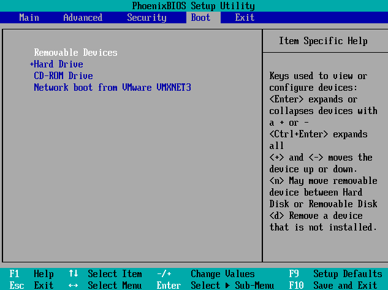
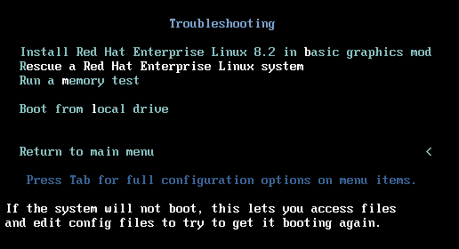

# EX342
Notes from Sander van vugt's EX342 course

# 1. Troubleshooting basics
Show journald messages for specific unit `journalctl -u service.unit`

Show messages with priority between emergency and error  `journalctl -p emerg..err` 

Show messages in specific interval `journalctl --since 2012-10-30 18:17:16 --until 2012-10-30 20:17:16`

Make journald logging persistent by creating /var/log/journal and setting SGID.

Note: If SELinux is not logging some violations (such as FTP writes) you might have to [turn it on](https://serverfault.com/a/545279/455579) with `semodule --disable_dontaudit --build`

# 2. Systems Monitoring

## 2.1 cockpit

Install package **cockpit**, then include exception in firewall-cmd. Login with root.

## 2.2 Performance co-pilot (PCP)

Install packages `pcp` and `pcp-system-tools` or the yum group Performance Tools.

Check service `pmcd.service` is running

Show performance with `pcp atop`

Documentation is in `pcp-doc` package, start with `man pcpintro`

Can view historical logging with `pmval` such as `pmval -a /var/log/pcp/pmlogger/rhcsa1.example.com/20221011.16.10.0 kernel.all.load`

## 2.3 Logging overview

rsyslog logs to /var/log with specified priority and facility.

rsyslog doesn't capture everything, the rest goes to systemd-journald

rsyslog offers remote logging

## 2.4 rsyslog remote logging

On rsyslog server:
1. Edit /etc/rsyslog.conf to uncomment these lines for TCP
  ```text
  module(load="imtcp") # needs to be done just once
  input(type="imtcp" port="514")
  ```
2. Add service or port exception to firewall-cmd
3. 

On rsyslog client:
1. Uncomment this line in rsyslog.conf
  ```text
  # remote_host is: name/ip, e.g. 192.168.0.1, port optional e.g. 10514
  #Target="remote_host" Port="XXX" Protocol="tcp")
  ```
2. Restart rsyslog.service

## 2.5 systems monitoring

Check what config files have changed from installation package with `rpm -Va`. Refer to `man rpm` for details.

Alternatively one can use AIDE

## 2.6 Configuring AIDE

* Advanced Intrusion Detection Environment (AIDE)
* Used to track changes to specified files

Install package `aide`

Config file in **/etc/aide.conf**

Steps to use:

1. Initialise DB with `aide --init`. Note location is specified in **/etc/aide.conf**. (This will take several min)
2. Rename database to **aide.db.gz** or you'll get this error
> Couldn't open file /var/lib/aide/aide.db.gz for reading
3. Make changes to monitored files
4. Run `aide --check` to list changes tracked.

## 2.7 `auditd`
* More flexible than `rpm -Va` which checks only against default config, or `aide` which requires DB to be set up.
* Beware of conflicting rules
* Start **auditd.service** to being monitoring
* audit log in /var/log/audit/audit.log
* auditd rules are processed from top to bottom when you run `auditctl -l`; more specific rules should be on top because once something matches it exits
  ```text
  -w /etc/passwd -p wa -k passwd-change
  -w /etc -p wa -k passwd-change
  ```

### 2.7.1 `auditctl` commands

* `-w` What to monitor
* `-p` What triggers the rule
* `-k` Log specific events with keywords

Adding rules

* To monitor files for changes in /etc do `auditctl -w /etc -p wa -k etc-change` where `etc-change` is the name of key for this rule
* To search for logs triggering this rule, do `ausearch -i -k etc-change`

Persist rules by appending `auditctl -l` to **/etc/audit/rules.d/audit.rules**

List rules with `auditctl -l`

Remove rule with `auditctl -W <watch>`, for [example](https://linux-audit.redhat.narkive.com/9AFXJ6Py/auditctl-how-do-i-remove-a-watch) if you have
```text
-w /etc -p wa -k etc-change
```
Then remove this rule with `auditctl -W /etc -p wa -k etc-change`

Suppose we want to monitor /etc/passwd with the rule `-w /etc/passwd -p wa -k user-change` then when user is added with `useradd`, `ausearch -i -k user-change` shows us what changed with all the syscalls logged.
```text
type=PROCTITLE msg=audit(11/12/2022 17:16:07.733:883) : proctitle=useradd -m bobby
type=PATH msg=audit(11/12/2022 17:16:07.733:883) : item=0 name=/etc/passwd inode=18937520 dev=08:01 mode=file,644 ouid=root ogid=root rdev=00:00 obj=system_u:object_r:passwd_file_t:s0 nametype=NORMAL cap_fp=none cap_fi=none cap_fe=0 cap_fver=0 cap_frootid=0
type=CWD msg=audit(11/12/2022 17:16:07.733:883) : cwd=/root
type=SYSCALL msg=audit(11/12/2022 17:16:07.733:883) : arch=x86_64 syscall=openat success=yes exit=8 a0=0xffffff9c a1=0x55896e894da0 a2=O_RDWR|O_NOCTTY|O_NONBLOCK|O_NOFOLLOW a3=0x0 items=1 ppid=5258 pid=9436 auid=ivan uid=root gid=root euid=root suid=root fsuid=root egid=root sgid=root fsgid=root tty=pts0 ses=1 comm=useradd exe=/usr/sbin/useradd subj=unconfined_u:unconfined_r:unconfined_t:s0-s0:c0.c1023 key=user-change
```

To make clear what's going on trace the event ID 883 with `ausearch -i -a 883` to see the full history.

# 3. Troubleshooting boot issues

## 3.1 Boot order
Taken from [RHCSA notes](https://github.com/ivanitlearning/RHCSA-Sander-van-vugt#18-essential-troubleshooting-skills):
1.  POST loads BIOS/UEFI
    1.  Boot rescue disk (not in RHCSA)
2.  Bootable device is located, bootloader is loaded (GRUB 2)
3.  Grub displays kernel menu and automatically loads one
    1.  Set `rd.break` here to avoid loading kernel, and remain in initramfs
    2.  Setting `init=/bin/sh` drops a root shell after mounting FS
4.  Kernel loads with initramfs (contains drivers for hardware needed to boot)
    1.  `/sbin/init` process (or systemd)
        1.  initrd.target units started
        2.  Root filesystem mounted on /sysroot
    2.  udev daemon
5.  System switches to root filesystem on disk
6.  Loads systemd from root FS on disk
    1.  Can configure to load **emergency.target** (smallest target) or **rescue.target** (next smallest)
7.  Default target is loaded

## 3.2 Low-level boot troubleshooting modes

This gets into the OS before systemd is loaded

### 3.2.1 Rescue disk
This is done when your bootloader is broken

After pressing magic key, boot from rescue disk. For my setup, it's F2 which brings this up

Select to boot from CD-ROM drive with rescue/install disc for CentOS/RHEL -> Save and Exit

Then you'll see this:

Select Troubleshooting

Select **Rescue a Red Hat Enterprise Linux system**. Then you'll see this

Press 1, in most cases then you'll see

Press Enter here, note the root FS location then you get a sh shell. Set it to your root with `chroot /mnt/sysimage`. It should already be mounted as rw. Now you have root access to filesystem while bypassing FS.
### 3.2.2 `rd.break` kernel boot argument
Covered in [RHCSA here](./README.md#181-passing-kernel-boot-arguments)
* Note here you can't run `ps aux` until you do `mount -t proc proc /proc`
* Systemd doesn't work here, you'll get error if you run `systemctl`
> Running in chroot, ignoring request
* SELinux is not loaded too, check with `getenforce`
### 3.2.3 `init=/bin/bash` kernel boot argument
A little more than `rd.break`
* Mounts root FS on `/`, still need to make it rw
* Doesn't load `/sbin/init` which loads systemd, so systemd not loaded will get error
> Failed to connect to bus: No such file or directory
* To get out, do `exec /sbin/init` (incidentally this is soft-linked to `systemd`)
* Neither ask for password, but here you can't reset root password.

## 3.3 Systemd boot troubleshooting modes
This loads systemd targets

### 3.3.1 `systemd.unit=emergency.target` kernel boot argument
* Requires root password
* Need to remount `/` as rw
* Minimal units loaded (check `systemctl list-units` or `systemctl list-dependencies`) around
* Loads minimal device units

### 3.3.2 `systemd.unit=rescue.target` kernel boot argument
* Loads a lot more device units than `emergency.target`

## 3.4 Understanding grub

  * Grub bootloader has stages 1, 1.5 and 2
  * Stage 1 is in MBR can view like this.
    * Check which block device **/boot** is mounted on, in my case it's **/dev/nvme0n1** then run `xxd /dev/nvme0n1 | less`
```text
00000160: 61ff 265a 7cbe 807d eb03 be8f 7de8 3400  a.&Z|..}....}.4.
00000170: be94 7de8 2e00 cd18 ebfe 4752 5542 2000  ..}.......GRUB .
00000180: 4765 6f6d 0048 6172 6420 4469 736b 0052  Geom.Hard Disk.R
00000190: 6561 6400 2045 7272 6f72 0d0a 00bb 0100  ead. Error......
000001a0: b40e cd10 ac3c 0075 f4c3 0000 0000 0000  .....<.u........
000001b0: 0000 0000 0000 0000 2f16 f2cd 0000 8004  ......../.......
000001c0: 0104 83fe c2ff 0008 0000 0060 0900 00fe  ...........`....
```
The rest of the bootloader is not readable.
* grub loads **/boot/grub2/grub.cfg**
* File generated by `grub2-mkconfig` from /etc/default/grub
* grub env file is in **/boot/grub2/grubenv**
## 3.5 Grub troubleshooting

