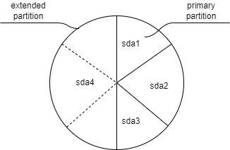
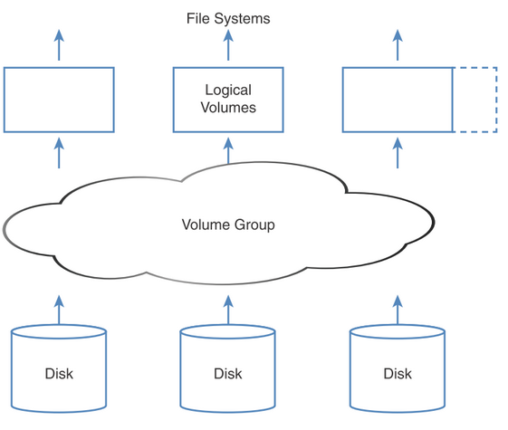
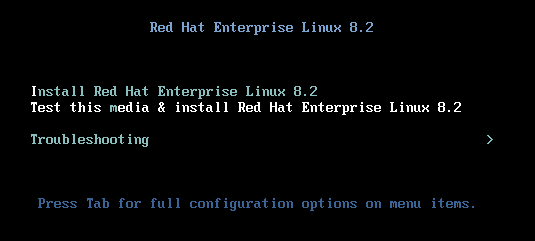
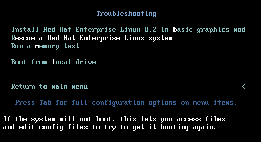
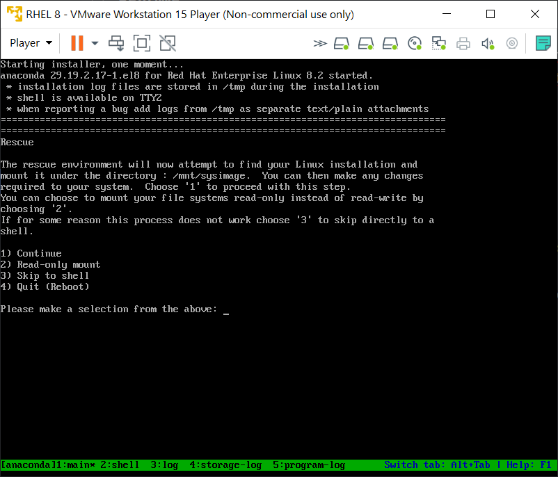
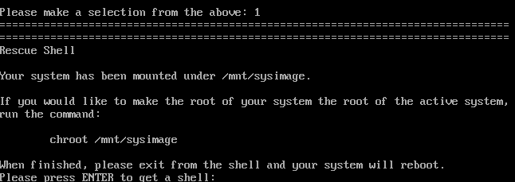
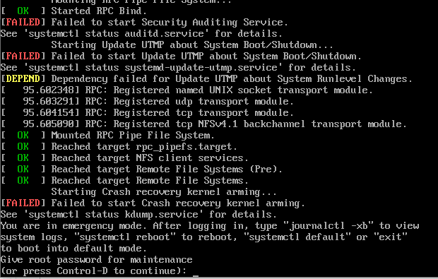

# Notes for RHCSA

RHCSA notes based on Sander van Vugt 3rd edn.

# 1. Basic system management

## 1.1 Essential tools

Some commands

`findmnt` - List all currently mounted filesystems

`!<num>` Run command in `history` line number

Redirect stderr only with `2>`

Use `type` to determine if a command is alias, builtin or external

```text
[ivan@localhost ~]$ type echo
echo is a shell builtin
[ivan@localhost ~]$ type cat
cat is hashed (/usr/bin/cat)
[ivan@localhost ~]$ type ls
ls is aliased to `ls --color=auto'
```

`time` used to determine how long it takes to execute a script or a command

Search titles and short description man pages for commands with `man -k keyword`. To search all man pages use `man -K keyword`. Case insensitive search with `-ki`

[Create DB](https://unix.stackexchange.com/questions/323007/man-k-returns-no-results) with `mandb -c` if there's no results

Can display item of man which matches with `man -f <command>`

Open manpage for specific man page type

```text
[ivan@localhost etc]$ man -k glob
File::DosGlob (3pm)  - DOS like globbing and then some
File::Glob (3pm)     - Perl extension for BSD glob routine
glob (3)             - find pathnames matching a pattern, free memory from glob()
glob (3p)            - generate pathnames matching a pattern
glob (7)             - globbing pathnames
glob.h (0p)          - pathname pattern-matching types
globfree (3)         - find pathnames matching a pattern, free memory from glob()
semanage.conf (5)    - global configuration file for the SELinux Management library
tuned-main.conf (5)  - Tuned global configuration file
vars (3pm)           - Perl pragma to predeclare global variable names
```

Open **glob (7)** with `man 7 glob`

Note you can use `help command` also, especially for bash scripting.

Globbing commands

```text
ls host*
ls ?ost
ls [hm]ost # Starting with either h or m
ls [!hm]ost # Anything that doesn't start with h or m 
ls script[0-9][0-9]
```

To grep a string with dash, such as `-a`, specify `--` to [signify end](https://unix.stackexchange.com/a/11382/312281) of command options eg

```text
[ivan@localhost ~]$ cp --help | grep -- -a
  -a, --archive                same as -dR --preserve=all
      --attributes-only        don't copy the file data, just the attributes
```

If you have an alias and don't want to invoke it, preface it with "\\"  eg `\rm` to avoid `rm -i`

Find files only `find . -size -1000c -type f` 
This finds files with <1000 chars. Otherwise specify `+1000c` for larger ones. Or omit `+/-` for exact file sizes. Works with k, M, G as well for file sizes. 

Find files with octal permissions `find /dir -perm 0777 -type f`

Find files modified in last 2 hours `find /dir -mmin 120 -type f`

Find files larger between 5MB and 10MB `find /dir -size +5M -size -10M -type f`

# 2. Essential tools
To clear bash history completely, remove ~/.bash_history and do `history -c`

# Filesystem tools

## 3.1 Filesystem tools

Copy and keep current permissions on files `cp -a /src /dst`

Hidden files not copied over by default, to do this copy recursively with `cp -r /src /dest`, alternatively `cp -a /src /dst/` tries to preserve as much as possible the source dirs.

Copy files over only and not the dir containing them with `cp -a /src/dir/. /dst/dir/`

## 3.2 Links

### Hard links

When you create a file you are creating a hard link, which contains everything about the file except its name, which is stored in directory.

* Can create multiple hard links to same file, but not at all to directories.
* Removing the last hard link to a file also removes access to the file's data.
* Must be owner of file you want to create hard link to

Create hard link to /etc/hosts with `ln /etc/hosts .` When doing `ls -ilah`, we can see the hard link counter (2)

```text
[ivan@localhost ~]$ ls -ilah hosts
34182727 -rw-r--r--. 2 root root 158 May 28 16:57 hosts
[ivan@localhost ~]$ ls -ilah /etc/hosts
34182727 -rw-r--r--. 2 root root 158 May 28 16:57 /etc/hosts
```

## 3.3 Working with tar and archives

Add file to existing archive `tar -rvf archive.tar /etc/hosts`, update newer file in archive with `-u`

Extract just one file from archive `tar -xvf etc.tar etc/hosts`

Typical command to zip in bzip2 is `tar -cjvf /path/to/archive.tar.bz2 /dir/to/zip`. Test with `tar -tvf /path/to/archive.tar.bz2`.

Note: Archives are not necessarily compressed, unless you also specify `-z` (gzip) or `-j`(bzip2)

Can use gzip or bzip to compress archive in place.

# 4. Working with text files

## 4.1 Regex with `grep`

* starting with anna `grep '^anna' /etc/passwd`
* ending with ash `grep 'ash$' /etc/passwd`
* missing one character `.`
* missing either a,o,u `[aou]`
* matches zero or 1 previous char `colou?r`. Returns *color* or *colour* 
* match the preceding char twice `\{2\}`
* match min 1 max 3 `\{1,3\}`
* starts with # or ; `^[#|;]`
* match files containing exactly 3 chars `^...$`
* match whole word root only `\broot\b`

## 4.2 sed and awk

Replace all old-text with new-text in place `sed -i s/old-text/new-text/g ~/myfile`

Print line 5 with sed `sed -n 5p /etc/passwd`


To print the last column with awk use `$NF`

## 4.3 head and tail

To print everything but last line `head -n -1`

Similarly for tail, everything but first line (exclude headers) `tail -n +2` (note the syntax here is starting with specified line number)

# 5. Connecting to RHEL

## 5.1 SSH

Add `ForwardX11 yes` to /etc/ssh/ssh\_config to allow X11 forwarding back to SSH client. Per session basis, use `ssh -X`

Copy the public ssh key to target computer with `ssh-copy-id IP`

## 5.2 tty

Switch between virtual consoles tty's with either `Ctrl Alt` F1-F6 or (change virtual terminal) `chvt 1-6` with sudo. Device files are **/dev/tty1** to **/dev/tty6**.

* 1 is login screen
* 2 is GUI console after logging in
* 3-6 seems to be just text based

# 6. User and group management

## 6.1 su

`su` with hyphen '-' uses the user's environment, while excluding it means keeping your current environment.

## 6.2 sudo

Add user to wheel group (allows sudo) with `usermod -aG wheel user`

How to read /etc/sudoers file

* `root ALL=(ALL:ALL) ALL` The first field indicates the username that the rule will apply to (**root**).
* `root ALL=(ALL:ALL) ALL` The first “ALL” indicates that this rule applies to all hosts.
* `root ALL=(ALL:ALL) ALL` Second “ALL” indicates that the **root** user can run commands as all users.
* `root ALL=(ALL:ALL) ALL` Third “ALL” indicates that the **root** user can run commands as all groups.
* `root ALL=(ALL:ALL) ALL` The last “ALL” indicates these rules apply to all commands.

## 6.3 /etc/passwd

Range of available UIDs for system and user accounts stored in **/etc/login.defs**

**/sbin/nologin** denies access to specified users

Create **/etc/nologin.txt** which is displayed to all users to deny access except root.

`useradd` to add users `userdel -r` to remove user with its files, `groupmod` to change groups. Prefer this over the editors

`usermod` can change the groups a user belongs to.

User settings stored in **/etc/login.defs** 

and 

**/etc/default/useradd** determines dir of $HOME

## 6.4 /etc/shadow

Possible for multiple users to have same UID but use different passwords because /etc/shadow doesn't have UIDs and only usernames eg. toor and root maps to UID 0.

Change password with either `passwd` or `chage` for password properties. Can also do this to avoid interactive input `echo password1 | passwd --stdin username`

`vipw` visudo for /etc/passwd, note it doesn't check correct syntax. `vigr` to edit /etc/groups

To view password policy for user, run `chage -l user`. Command can also be used interactively with `chage user`

Can lock passwords for users which prevents them from logging in with password with `passwd -l username`

## 6.5 Home dirs

When creating home directories for users, files are copied over from **/etc/skel** to \~

## 6.6 Groups

User's primary group defined in /etc/passwd, can also be member of one or more secondary groups.

Create group with `groupadd`

List all users belonging to group with `lid -g groupname`

Remove user from group with `gpasswd -d anna profs`

To change primary group for user:

1. Switch to that user with `su`
2. Do `newgrp group`, check with either `id` or `groups` that the primary group (listed first) has changed.

Or to permanently change primary group, use `usermod user -g groupname`

# 7. Permissions Management

## 7.1 RWX permissions

| Permission | Files                | Dir                                                       | Numeric |
| ---------- | -------------------- | --------------------------------------------------------- | ------- |
| Read       | Open file            | List contents                                             | 4       |
| Write      | Modify file contents | Create/delete files                                       | 2       |
| Execute    | Run programs         | Can `cd` to dir<br />Need this to do anything in that dir | 1       |

So 755 permissions would be 4 + 2 + 1 = 7 for owner and 4+1=5 for group and other.

Note that you can delete any file (including root-owned) as long as you own the dir.

Linux applies permissions by checking and exiting upon first match but note that file owners can always change permissions.

### 7.1.1 Relative permissions

Add execute permissions for owner, group and other with `chmod +x somefile`

Always add `rx` to directory and never just `r` because otherwise you can't enter it.

Add write permissions to group, remove read for others `chmod g+w, o-r somefile`

Can do recursive permissions assignment with `chmod -R o+rx /data`

Note you can set explicit permissions with `=` by `chmod o=rx file`

Apart from `chown`, `chgrp` can also be used to set group.

## 7.2 Advanced permissions

### 7.2.1 SUID/SGID permissions

When SGID applied to directory, any file or directories created will inherit directory group owner as well.

Setting SUID on directory has no effect.

Apply SUID `chmod u+s` or SGID `chmod g+s`

### 7.2.2 Sticky bit

When enabled on directories (check like this).

```text
[root@hnl data]# ls -ld account/
drwxr-sr-t. 2 root account 4096 Apr 30 21:28 account/
```

You can delete files only when either are true:

* The user is owner of the file.
* The user is owner of the directory where the file exists.

Set sticky bit with `chmod +t`  or numeric value 1.

**No effect** when applied to files.

Set SUID with numeric value 4, SGID with 2, and sticky bit 1 eg. `chmod 2755 /somedir`

## 7.2.3 ACLs

If you see a '+' for the directory permissions, there's an ACL applied

```text
[ivan@localhost ~]$ ls -lah /data
total 0
drwxr-xr-x.  4 root  root     34 Feb 12 00:57 .
dr-xr-xr-x. 18 root  root    236 Feb 12 00:57 ..
drwxrwx---+  2 linda account  22 Feb 12 04:15 account
drwxrws--T+  2 linda sales    34 Feb 12 01:09 sales
```

Permissions only allow a single owner, group or others. Not multiple owners, group or others.

To check ACLs set do `getfacl /data/account/`

To set group rx permissions for **/data/account/** `setfacl -m g:sales:rx /data/account`, verify with getfacl

```text
[root@localhost ~]# getfacl /data/account/
getfacl: Removing leading '/' from absolute path names
# file: data/account/
# owner: linda
# group: account
user::rwx
group::rwx
group:sales:r-x
mask::rwx
other::---
```

Specify `-R` to apply `setfacl` recursively to all files, dirs in directory.

Remove all ACL permissions for a user/group with `setfacl -m u:anna:- /tmp/myfile` or remove the ACL entry with `setfacl -x u:anna`

Note to deny a specific user all access set their permissions as `---`

Can set inherited ACLs (for all new items in dir) with `setfacl -m d:`, note that this **doesn't** change existing files/dirs but only new ones. Note you don't need to specify `-R` to make it recursive; that's automatic. `d:` here stands for default.

Set no default permissions for principal others `setfacl -m d:o::- /dir`

```text
[root@localhost ~]# setfacl -m d:g:account:rx,g:sales:rwx /data/sales
[root@localhost ~]# getfacl /data/sales
getfacl: Removing leading '/' from absolute path names
# file: data/sales
# owner: linda
# group: sales
# flags: -st
user::rwx
group::rwx
group:sales:rwx
group:account:r-x
mask::rwx
other::---
default:user::rwx
default:group::rwx
default:group:account:r-x
default:mask::rwx
default:other::---
```

### 7.2.4 umask

Default umask of 666 for files and 777 for dirs, subtract the desired umask value. Stored in /etc/profile and /etc/bashrc

| Value | Files       | Dirs              |
| ----- | ----------- | ----------------- |
| 0     | Read, write | Everything        |
| 1     | Read, write | Read, write       |
| 2     | Read        | Read, execute     |
| 3     | Read        | Read              |
| 4     | Write       | Write and execute |
| 5     | Write       | Write             |
| 6     | Nothing     | Execute           |
| 7     | Nothing     | Nothing           |

Eg. to assign 755 for new dirs, and 644 for new files, specify umask as 022 because 666 - 022 = 644, 777 - 022 = 755 `umask 022`

Ignore the first zero when you run `umask` to check setting.

Set umask setting in /etc/profile for all users.

### 7.2.5 User-extended attributes

Use chattr to apply attributes, one of which is immutable for files eg. `chattr +i somefile`.

Remove with `chattr -i somefile`

List attributes with `lsattr`

# 8. Networking

## 8.1 Validating config

Display routing table `ip route` or `route -n`

Show statistics with `ip -s a`

Set IP address for interface **eth0** with `ip addr add 10.0.0.10/24 dev eth0`

Note that legacy interface names of **eth0** only appears when the NIC driver can't reveal anything about its location.

```text
2: ens160: <BROADCAST,MULTICAST,UP,LOWER_UP> mtu 1500 qdisc mq state UP group default qlen 1000
    link/ether 00:0c:29:f6:86:61 brd ff:ff:ff:ff:ff:ff
    inet 192.168.92.155/24 brd 192.168.92.255 scope global noprefixroute ens160
       valid_lft forever preferred_lft forever 
    inet6 fe80::9c9f:9c35:cd1b:e6a3/64 scope link noprefixroute
       valid_lft forever preferred_lft forever
```

* **valid\_lft** Valid lifetime of IP
* **scope global** tells you the scope of the IP address, global or local

Delete route from route table with `ip route delete 10.0.1.0/24`

Add default route with `route add default gw 192.168.1.254 eth0`

Add route to 192.168.1.0/24 `ip route add 192.168.1.0/24 dev eth0`

Use `nmtui` to add route permanently via interface. Deactivate and reactivate to make permanent.

## 8.2 Network config with `nmtui` and `nmcli`

Core concepts:

1. Connections are attached to interfaces.
2. NetworkManager reads these from configuration files and applies to interfaces

Note: The `network.service` doesn't exist in RHEL 8 anymore.

Check `nmcli` permissions with `nmcli gen permissions`

Config made with `nmcli` persists.

List interfaces with `nmcli con show` and add interface name after that to list details eg. `nmcli con show ens160`

Display all devices and status `nmcli dev status` and display device status with `nmcli dev show ens160`

Show nmcli examples with `man nmcli-examples`

Use `nmtui` to add a connection to an interface, can specify type, address, GW.

* **Automatic** option means DHCP client will be used.
* Specify subnet mask in the address or /32 will be assumed.

Or use `nm-connection-editor` to edit interfaces, require x11-forwarding.

## 8.3 Network config files

Every connection created stores a config file in dir **/etc/sysconfig/network-scripts**. Can edit that for config then use `nmcli con up interface-name` and restart service NetworkManager.

To set a static and DHCP address on the same interface, use `nmtui` to specify Automatic ip config and also specify an IP address.

## 8.4 Hostnames and DNS

Change hostnames with

1. `nmtui`
2. `hostnamectl set-hostname name`
3. Edit **/etc/hostname**

### 8.4.1 DNS

DNS resolution order determined in /etc/nsswitch.conf eg `hosts: files dns myhostname`

In /etc/hosts, first column is short name, 2nd FQDN and 3rd onwards are aliases

DNS server specified in network script dir, and pushed to **/etc/resolv.conf**, which is overwritten every time.

Ways to specify DNS resolver

1. `nmtui`
2. **/etc/sysconfig/network-scripts**
3. DHCP
4. `nmcli con mod <connection-id> [+]ipv4.dns <ip-of-dns>`

To prevent DHCP assignment from setting DNS resolver

1. Edit **/etc/sysconfig/network-scripts** to include **PEERDNS=no**
2. Use `nmcli con mod <con-name> ipv4.ignore-auto-dns yes`

Verify DNS resolution with `getent hosts hostname`

Also can test with `dig microsoft.com`

# 9. Managing software

Traditionally packages are managed with `yum` but replaced with `dnf` recently, but still runs with `yum`. Packages provide in Red Hat Package Manager (RPM) format.

## 9.1 Registering RHEL

Need to register RHEL for support and access to repositories

Register with `subscription-manager register`. Requires RH user account and password.

List available subscriptions with `subscription-manager list --available`

Attach subscription to available repositories `subscription-manager attach --auto`. Run this after registering.

List subscriptions with `subscription-manager list --consumed`

Unregister subscriptions with `subscription-manager unregister`

## 9.2 Specifying RHEL repos

Repos are specified in **/etc/yum.repos.d** Format:

* **[label]** Short name for repo
* **name** Specify name of repository you want to use
* **baseurl** URL of repo to use (Specify file-based with file:///repo)
* **gpgcheck** Set 1 to enable GPG integrity check
* **gpgkey** Location of GPG key file

Eg.

```text
[AppStream]
name=AppStream
baseurl=file:///repo/AppStream
gpgcheck=0
```

Alternatively you can use `yum-config-manager --add-repo file:///newrepo` from `yum-utils` package. This generates the .repo file in /etc/yum.repos.d/ so you can edit it.

To mount a CD-ROM drive as a filesystem

1. Check device path of CD-ROM with `blkid`, confirm it's /dev/sr0, and note the type (typically **iso9660**)
2. Add line `/dev/sr0 /mnt/point iso9660 defaults 0 0` to **/etc/fstab**
3. `mount -a`

Alternatively `mount -t iso9660 -o ro /dev/sr0/ /mnt/point`

Run `createrepo /rhel_repo/` *after* editing **/etc/yum.repos.d/\*.repo** ,when new packages are added to the repo dir.

**Exam note**: Won't be allowed to connect to RH online repo, so have to create repo yourself.

## 9.3 `yum` commands

Search for exact package name `yum search`

Search for files or commands in packages `yum provides */filename`

Get info on packages `yum info packagename`

Query package, even list its contents without installing with `yum repoquery -l package-name`

Install with `yum install`

Install exact version of package:
```text
[root@localhost ~]# yum list createrepo_c --showduplicates
Updating Subscription Management repositories.
Last metadata expiration check: 0:06:21 ago on Sat 02 Jul 2022 11:05:38 AM PDT.
Available Packages
createrepo_c.x86_64                                          0.11.0-1.el8                                            rhel-8-for-x86_64-appstream-rpms
createrepo_c.x86_64                                          0.11.0-3.el8                                            rhel-8-for-x86_64-appstream-rpms
createrepo_c.x86_64                                          0.15.1-2.el8                                            rhel-8-for-x86_64-appstream-rpms
createrepo_c.x86_64                                          0.15.11-2.el8                                           rhel-8-for-x86_64-appstream-rpms
createrepo_c.x86_64                                          0.16.2-2.el8                                            rhel-8-for-x86_64-appstream-rpms
createrepo_c.x86_64                                          0.17.2-3.el8                                            rhel-8-for-x86_64-appstream-rpms
createrepo_c.x86_64                                          0.17.7-5.el8                                            rhel-8-for-x86_64-appstream-rpms
```

Drop [the .x86_64](https://unix.stackexchange.com/questions/151689/how-can-i-instruct-yum-to-install-a-specific-version-of-package-x) from the package name, and include the version with `yum install createrepo_c-0.11.0-1.el8`.

Can also do local install of rpm packages with `yum install package.rpm`, will find and download missing dependencies.

Reinstall with `yum reinstall`, nevermind if `reinstall` doesn't appear on bash-completion; it'll still work.

Remove with `yum remove`

Note that protected packages such as **vi** can't be removed.

List repos with `yum repolist`, do this to check if repos are installed properly.

List installed packages with `yum list all | installed`, installed lists installed ones only.

Update one package only with `yum update packagename`

Get from repos all available updates for package `yum list updates packagename`. List with `yum list --showduplicates packagename`

List previously installed packages with `yum history`

Undo yum install with `yum history undo <nn>` with number from `yum history`

Download packages only without installing `yum install packagename --downloadonly --downloadir /path/to/save`

Or use yumdownloader with `yumdownloader packagename` to save to current workdir. Beware this doesn't seem to DL dependencies.

### 9.3.1 `yum`  groups

Groups are packages grouped together for similar purpose eg. Security Tools.

Get info about group packages with `yum groups info "Basic Web Server"`

Packages can be grouped, list them with `yum groups list [hidden]`

This is so you don't have to remember package names like **nfs-utils**, when you can first do a `yum groups list --hidden | grep -i file` to find the group **File and Storage Server**, then list its contents with `yum groups info groupname`

## 9.4 Package Module Streams

Modules are set of packages that belong together, typically organised around a specific version of an application including its dependencies.

Each module can have multiple application streams, with each stream containing a specific version and related updates. Only 1 stream may be enabled at any one time.

Unlike groups, modules [can be versioned](https://unix.stackexchange.com/questions/603905/what-is-the-difference-between-a-yum-group-and-a-yum-module-in-red-hat-enterpris) to freeze package versions.

Note: To install a specific version, install via module, not packages.

Modules can also have profiles, which is a list of packages installed together for a particular use case such as default, minimal, server profiles etc.

List module profiles with `yum module info modulename --profile`

List modules with `yum module list modulename`. Can also omit module name to list everything. Note the **\[i]** beside the stream denotes the installed profile.

Get module info for a particular stream with `yum module info perl:5.26`

Enable module stream with `yum module enable perl:5.24`, this prepares the stream without actually installing it.

Install modules and profile with `yum module install modulename:streamversion/profile`.  This also enables the specified stream.

* If stream not specified, will assume default module stream.
* Running this command will also switch to that specified stream.

Run `yum distro-sync` to update all dependent packages that are not in the module.

Return all streams to initial state, neither enabled/disabled. Default stream gets activated. `yum module reset php`

Specify `--allowerasing` to allow deletion of installed packages to resolve.

## 9.5 Package management with `rpm`

Avoid using rpm as it doesn't handle dependencies well.

List installed packages `rpa -qa`

Get list of files in package with `rpm -ql packagename` (need to be installed)

* List doc files of package with `rpm -qd`
* List config files with `rpm -qc`

Get description of package with `rpm -qi packagename`

List packages which have a specific file `rpm -qf /bin/ls`. Must provide full path to file, can be any file.

Note that once downloaded you can install packages with `yum install packagename`

Check scripts that will run in package with `rpm -qp --scripts package.rpm` during installation.

# 10. Managing Processes

List running jobs with `jobs`

After backgrounding jobs with **Ctrl-Z**, do `bg jobnumber` to resume it in background.

Kernel threads can't be killed or have their priority adjusted.

```text
[ivan@localhost ~]$ ps -aux | head
USER         PID %CPU %MEM    VSZ   RSS TTY      STAT START   TIME COMMAND
root           1  0.2  0.2 180124 14516 ?        Ss   17:42   0:06 /usr/lib/systemd/systemd --switched-root --system --deserialize 17
root           2  0.0  0.0      0     0 ?        S    17:42   0:00 [kthreadd]
root           3  0.0  0.0      0     0 ?        I<   17:42   0:00 [rcu_gp]
root           4  0.0  0.0      0     0 ?        I<   17:42   0:00 [rcu_par_gp]
root           6  0.0  0.0      0     0 ?        I<   17:42   0:00 [kworker/0:0H-kblockd]
root           8  0.0  0.0      0     0 ?        I<   17:42   0:00 [mm_percpu_wq]
root           9  0.0  0.0      0     0 ?        S    17:42   0:00 [ksoftirqd/0]
root          10  0.0  0.0      0     0 ?        I    17:42   0:00 [rcu_sched]
root          11  0.0  0.0      0     0 ?        S    17:42   0:00 [migration/0]
```

## 10.1 `ps` commands

Process started from shell is child process of that shell. All processes killed when shell is stopped.

Use `kill` to stop background jobs.

**Ctrl-D** sends EOF character and ends the job.

If a parent process is killed when child process is active, child process becomes child of systemd instead.

List processes with either `ps aux` or `ps -ef`

List parent-child processes with `ps -fax`

List processes started by a user `ps -fU username`

Show process tree for a specific process named **sshd** `ps -f --forest -C sshd`

Display format columns with `ps L` then select them with `ps -eo pid,user`

## 10.2 Process priority

Linux processes are started with a certain priority, by default all are equal (20).

* Lower number priority are higher
* Ranges from -20 to 19

To change priority of process PID 3233 to 10 ` renice -n 10 -p 3233`

Or specify NI of process with `ni -n 1 dd command`

Regular users can only decrease priority, only root can increase.

Processes with lower NI get more %CPU in `top`

Note: PR = 20 + NI ([ref](https://askubuntu.com/questions/656771/process-niceness-vs-priority))

## 10.3 Killing processes

View all signals with `man 7 signal`

Signal commands

* Ask process to terminate with SIGTERM (15)
* Force process to stop with SIGKILL (9)
* SIGHUP process (1), will cause process to reread config files, useful for changes.

By default `kill` uses SIGTERM, which may not work. If it doesn't use SIGKILL with `kill -9 [PID]`

A few types of `kill` signals
* 1 SIGHUP - Terminal closes (similar to SIGTERM)
* 2 SIGINT - Ctrl-C (stop and wait for further input)
* 3 SIGQUIT - Same as SIGTERM but generates core dump file on exit
* 9 SIGKILL - Terminate immediately, don't return control to process and no cleanup
* 15 SIGTERM - Default kill signal (allows process to save progress)

List signal names with `kill -l`

`pkill` kills process by name instead of PID (check with `ps` only)

`killall` terminates all processes with same name

## 10.4 Using `top`

### Linux process states

| State                     | Meaning                                                        |
| ------------------------- | -------------------------------------------------------------- |
| Running (R)               | Active and using CPU time                                      |
| Sleeping (S)              | Waiting for event, or inputs. Can be stopped here with Ctrl-C. |
| Uninterruptible sleep (D) | Sleep state that can't be stopped.                             |
| Stopped (T)               | Stopped process, typically using Ctrl-Z                        |
| Zombie (Z)                | Stopped but can't be removed by parent.                        |

Priority **rt** can't be changed and are highest priority.

High **wa** typically indicates system is suffering from slow disk ops.

### Commands in `top`

* In `top` interface, press `k` to select process to terminate, then followed by signal type (default SIGTERM 15). 
  * Press `h` to show below hot keys.
  * Press `r` to renice process PID
  * Press `1` to display CPU stats for each.
  * Press `Shift-M` to sort by %MEM, `Shift-P` by %CPU
  * Press `z` for colours
  * Press `F` to select fields to display

View load average with either `top` or `uptime` for last 1, 5 and 15 min.

Rule of thumb: Load average shouldn't be higher than number of CPUs. Check with `lscpu`

CPUs = Threads per core x Cores per socket x sockets \[[ref](https://unix.stackexchange.com/questions/218074/how-to-know-number-of-cores-of-a-system-in-linux)]

## 10.5 Using `tuned` to optimise performance

List available profiles with `tuned-adm list`

Show active profile `tuned-adm active`

Check tuned running status with `service`

Check profile recommendation with `tuned-adm recommend`

Switch to specified profile `tuned-adm profile profilename profilename2`, can specify multiple active profiles!

## 10.6 Reading memory

**Free** is memory not used currently, while **available** considers memory in buffer and cache that can be liberated immediately.

## 10.7 `lsof`

List files opened by process PID 2833 `lsof -p 2833`

# 11. Working with systemd

Systemd runs units (of which service is one of them), types of which you can get a list by doing `systemctl -t help`. It manages everything after Linux kernel starts.

Unit files are processed in the following priority if multiple exists for same unit

Default unit files in **/usr/lib/systemd/system** - Lowest priority

Custom unit files in **/etc/systemd/system** - 2nd highest priority

Automatically generated unit files in **/run/systemd/system** - Highest priority

Change systemd editor with `export SYSTEMD_EDITOR=/usr/bin/vim`

## 11.1 Service units

Reading service unit files

```text
[Unit]
Description=Vsftpd ftp daemon
After=network.target # Service should start after this. Before indicates running before specified unit.

[Service]
Type=forking
ExecStart=/usr/sbin/vsftpd /etc/vsftpd/vsftpd.conf # How to start service. ExecStop specifies how to stop

[Install]
WantedBy=multi-user.target
```

## 11.2 Mount units

[Differences](https://unix.stackexchange.com/questions/528134/difference-between-mounting-approaches) between fstab and systemd mount

Example of tmp.mount

```text
[Unit]
Description=Temporary Directory (/tmp)
Documentation=man:hier(7)
Documentation=https://www.freedesktop.org/wiki/Software/systemd/APIFileSystems
ConditionPathIsSymbolicLink=!/tmp
DefaultDependencies=no
Conflicts=umount.target # units that can't work with this.
Before=local-fs.target umount.target
After=swap.target

[Mount] # Same syntax as mount command
What=tmpfs
Where=/tmp
Type=tmpfs
Options=mode=1777,strictatime,nosuid,nodev

# Make 'systemctl enable tmp.mount' work:
[Install]
WantedBy=local-fs.target
```

## 11.3 Socket units

Files are \*.socket files

**ListenStream** for TCP and **ListenDatagram** for UDP

Used to ensure daemons start up only when needed.

.service files need to have the same name; cockpit.socket needs cockpit.service

## 11.4 Target units

Group of units. For example, **multi-user.target** requires **basic.target** units to be started first, since the latter is specified under **Requires**

Load ordering is also supported with **Before** and **After**

The **\[Install]** section of a unit tells systemd which target to add the unit to when you run `systemctl enable`

When enabled, systemd creates symbolic links in /etc/systemd/system subdirs. See later chapter on managing boot process for details.

## 11.5 Systemd unit file syntax

Readable explanation [here](https://www.digitalocean.com/community/tutorials/understanding-systemd-units-and-unit-files)

**[Unit]** Section

* **`Requires=`**: Units listed here must successfully activate as well, else this unit will fail. These units are started in parallel with the current unit by default.
* **`Wants=`**:  Less strict than Requires. If these units are not found or fail to start, the current unit will continue to function. Parallel activation unless modified by other directives.
* **`Before=`**: The units listed in this directive will not be started until the current unit is marked as started if they are activated at the same time.
* **`After=`**: The units listed in this directive will be started before starting the current unit.

**[Install]** Section

* `WantedBy=`: Having this creates a dependency with the specified unit. If multi-user-target is specified, then a symlink to the unit file is created in **/etc/systemd/system/multi-user.target.wants/**. Units in that directory start when multi-user.target starts
* `RequiredBy=` Stricter than `WantedBy`, will fail the directive-listed unit if the current unit can't start.

## 11.6 Managing with `systemctl`

Start with `systemctl start servicename.service`

Start on boot with `systemctl enable servicename.service`. Important for RHCSA.

```text
[root@localhost ~]# systemctl status vsftpd.service
● vsftpd.service - Vsftpd ftp daemon
   Loaded: loaded (/usr/lib/systemd/system/vsftpd.service; disabled; vendor preset: disabled)
   Active: active (running) since Thu 2022-03-17 08:51:10 PDT; 15s ago
  Process: 5149 ExecStart=/usr/sbin/vsftpd /etc/vsftpd/vsftpd.conf (code=exited, status=0/SUCCESS)
 Main PID: 5150 (vsftpd)
    Tasks: 1 (limit: 35797)
   Memory: 584.0K
   CGroup: /system.slice/vsftpd.service
           └─5150 /usr/sbin/vsftpd /etc/vsftpd/vsftpd.conf
```

* Loaded: **disabled** means service is not configured to start on boot.
* When done editing systemd.service file do `systemctl daemon-reload`

Note: "loaded" just means the units are read [from disk into memory](https://unix.stackexchange.com/questions/336443/systemd-loaded-vs-enabled-unit-state). Doesn't mean they are active (aka running). To list everything including those not loaded do `systemctl list-unit-files`

List service units with `systemctl list-units --type=service`

List all units (including non-service) `systemctl list-units`

List all services including dead/inactive ones `systemctl --type=service --all`

List all service dependencies with `systemctl list-dependencies vsftpd`, to see which unts depends on this, `--reverse`

Cat the service unit file with `systemctl cat httpd.service`

Edit unit files with `systemctl edit --full svcname.service`, file created in **/etc/systemd/system**

Show options for config file `systemctl show httpd.service`, note you can use apropos to find man pages for **systemd.service** to understand the options.

Check section options for .unit files with `man -k systemd.unit`

Prevent unit from being started with `systemctl mask name.service`. Undo with `systemctl unmask name.service`. Differs from `disable` in that nothing can start it, not even manually or other serivices.
* This creates symlink in /etc/systemd/system/file.service to /dev/null
* Must remove existing file from /etc/systemd/system/ first

Can disable with `systemctl disable` but unlike mask this can still be started manually or by other services.

# 12. Tasks

Service **crond.service** is what checks for tasks to be started every min.

Cron time/date expressions available with `man 5 crontab`, or read **/etc/crontab**

Cron config files are found in **/etc/cron**\*

* If you need regular tasks but not specific timings dump it in /etc/cron.hourly,daily,weekly,monthly
* Note that when scheduled times conflict eg. 11th of month, but not weekdays, it'll run on both inclusive.

Create cron files as user with `crontab -e -u username`, these are stored in **/var/spool/cron**. Note that you don't specify the user to run as unlike in **/etc/crontab**.

Allow users to create cronjobs if their name is in **/etc/cron.allow**, deny if their name is in **/etc/cron.deny**. Both files can't exist at same time.
* Check `man crontab` for how exactly this works

Note: `run-parts` runs all the commands in the directory.

## 12.1 `anacron` tasks

**anacron** an alternative to cron that can see when the scheduled task was last run, and run it if more than 24 hours. Can only run daily at most

Used to run scheduled tasks without specifying exact times, such as 
* /etc/cron.hourly
* /etc/cron.daily
* etc..

[Explanation](https://www.digitalocean.com/community/tutorials/how-to-schedule-routine-tasks-with-cron-and-anacron-on-a-vps), name taken from *anachronistic*

Syntax at **/etc/anacrontab**, and check `man anacrontab` for more.

Example: The last job, named **db_cleanup**  runs once every 10 days, with 5 min delay and does `/usr/bin/touch /root/anacron_created_this`
```text
#period in days   delay in minutes   job-identifier   command
1       5       cron.daily              nice run-parts /etc/cron.daily
7       25      cron.weekly             nice run-parts /etc/cron.weekly
@monthly 45     cron.monthly            nice run-parts /etc/cron.monthly
10      5       db_cleanup /usr/bin/touch /root/anacron_created_this
```

## 12.2 Non-recurring future task with `at`

`at time` to schedule non-recurring tasks, works with service **atd.service**.

* Very flexible time specification: 6pm, 18:00, 1800, or even "6pm tomorrow"

`atq` to list all current scheduled jobs

`atrm job-number` removes job at job-number. Check `man at` to see possible `at` commands.

Check man page for `at.deny` to see how to use /etc/at.allow and /etc/at.deny

# 13. Logging

Access **journald** logs with `journalctl`

However, since **journald** logs isn't persistent between reboots, messages are forwarded to rsyslogd service, which writes to **/var/log**

Check logs in 3 places

1. **/var/log logs**
2. `journalctl` command
3. `systemctl status <unit>`

**System log files overview**

| Log file          | Contents              |
| ----------------- | --------------------- |
| /var/log/messages | Syslog                |
| /var/log/dmesg    | Kernel log            |
| /var/log/secure   | Auth-related messages |
| /var/log/boot.log | System startup logs   |
| /var/log/httpd/\* | Apache logs           |

Write to syslog with `logger`

## 13.1 Configure rsyslogd

Rsyslog is a centralised logging system in Unix, runs as service **rsyslogd**

Configure with **/etc/rsyslog.conf**, or put file **/etc/rsyslog.d**

Pass specific parameters to rsyslogd service upon starting with **/etc/sysconfig/rsyslog**, can check rsyslog.service file for this.

Check man page for rsyslog.conf for explanation of options.

Supports centralised logging in company

### 13.1.1 rsyslog.conf

MODULES - Rsyslog is modular

GLOBAL DIRECTIVES - Where log files should be placed

RULES - What type of information should be logged to which logfile

```text
# Everybody gets emergency messages
*.emerg                                                 :omusrmsg:* # module
# Log anything (except mail) of level info or higher.
# Don't log private authentication messages!
*.info;mail.none;authpriv.none;cron.none                /var/log/messages
# Log all the mail messages in one place.
mail.*                                                  -/var/log/maillog
```

* Dash before the log file location tells it to buffer before writing
* Format is {facility}.{priority}

### 13.1.2 Rsyslog facilities

Category of information that's logged (not exhaustive)

| Facility      | Used by                                                                                            |
| ------------- | -------------------------------------------------------------------------------------------------- |
| auth/authpriv | Messages related to authentication. Note: security facility deprecated                             |
| cron          | Messages generated by the **crond** service.                                                       |
| daemon        | Generic facility that can be used for nonspecified daemons.                                        |
| kern          | Kernel messages.                                                                                   |
| mail          | Email-related messages.                                                                            |
| mark          | Special facility that can be used to write a marker periodically.                                  |
| news          | Messages generated by the NNTP news system.                                                        |
| syslog        | Messages generated by the syslog system.                                                           |
| user          | Messages generated in user space.                                                                  |
| local0-7      | Messages generated by services that are configured by any of the local0 through local7 facilities. |

### 13.1.3 Rsyslog priorities

In order of increasing priority. Note when specified, priorities and above for each facility are logged.

| Priority       | Description                                                                            |
| -------------- | -------------------------------------------------------------------------------------- |
| debug          | Debug messages that will give as much information as possible about service operation. |
| info           | Informational messages about normal service operation.                                 |
| notice         | Informational messages about items that might become an issue later.                   |
| warning / warn | Something is suboptimal, but there is no real error yet.                               |
| err / error    | A noncritical error has occurred.                                                      |
| crit           | A critical error has occurred.                                                         |
| alert          | Message used when the availability of the service is about to be discontinued.         |
| emerg / panic  | Message generated when the availability of the service is discontinued.                |

Both priorities and facilities in **rsyslog.conf** man page or logger man page.

To configure logging only a specific priority to file, such as a cron debug priority only, specify '='

```text
cron.=debug -/var/log/cron.debug
```

rsyslog allows you to send emergency message to currently logged on users

```text
# Everybody gets emergency messages
*.emerg                                                 :omusrmsg:*
```

So when you write to alert level emerg it shows up to everyone

```text
[root@localhost ~]# logger -p mail.emerg "Testing"
[root@localhost ~]#
Broadcast message from systemd-journald@localhost.localdomain (Tue 2022-07-12 01:50:52 +08):

ivan[12959]: Testing


Message from syslogd@localhost at Jul 12 01:50:52 ...
 ivan[12959]:Testing
```

### 13.1.4 rsyslog eg config

1. In **/etc/httpd/conf/httpd.conf**, add this line so it logs to local1
  ```text
  ErrorLog    syslog:local1
  ```
2. Then in **/etc/rsyslog.conf** add this line to tell it where to write the log to
  ```text
  local1.error        /var/log/httpd-error.log
  ```
3. Restart rsyslog.service

To use logger to write debug priority msg do `logger -p daemon.debug "Debug msg"`

### 13.1.5 Log rotate

Settings in **/etc/logrotate.conf**, check man page

Put additional settings in **/etc/logrotate.d**

## 13.2 journald

systemd-journald.service logs to **/dev/log**, which is monitored by rsyslog and directed output to **/var/log/**\*

Journal by default stored in **/run/log/journal** in binary and non-persistent. To make persistent, set `Storage=auto` in  **/etc/systemd/journald.conf** to write to **/var/log/journal** dir (also see `man journald.conf`)

Configure journald parameters with **/etc/systemd/journald.conf**

Options for **Storage** parameter man page for journald.conf

Steps to configure persistent **/var/log/journal**

1. Create **/var/log/journal** dir
2. Ensure Storage parameter in **/etc/systemd/journald.conf** is auto at least
3. Set group ownership of dir to systemd-journald
4. Set GUID for /var/log/journal so group can write
5. Reboot

### 13.2.1 `journalctl`

Live view of journalctl `journalctl -f`

Show messages logged for specific account `journalctl _UID=1000`

Show error priority messages only `journalctl -p err`, check man page to see what priority levels.

Show messages from time period `journalctl --since {YYYY-MM-DD hh:mm:ss}`. Can also use `--until`

Add `-o verbose` flag to see detailed output

Once persistent, view journald messages since last boot with `journalctl -b`

View service logs with `journalctl -u sshd.service -xe`

# 14. Storage

## 14.1 Common disk device types

| Device name  | Description             |
| ------------ | ----------------------- |
| /dev/sda     | HDD that uses SCSI      |
| /dev/nvme0n1 | NVMe interface (n1, n2) |
| /dev/hda     | Legacy IDE disk device  |
| /dev/vda     | Common KVM disk driver  |
| /dev/xvda    | Xen virtualisation      |

## 14.2 Disk layout

* Partitions are slices of a disk
* They are named in sequence eg.
1. /dev/sda1
2. /dev/sda2
3. /dev/sda3



## 14.3 Disk layouts

BIOS - MBR (master boot record)
* 4 partitions only
  * 512 bytes for boot
  * Max 2 TB total
  * 64 bytes
* Last partition used to address all remaining disk space
  * Within the last extended partition, you can create logical partitions to extend
  * Logical partitions always start at 5, eg sda5
* Virtual servers use MBR rather than GUID

UEFI - GPT (GUID partition table)
* 128 partitions max
* Typical for physical server

## 14.3 Commands

List block partitions `lsblk -p`

List device files for partitions `ls -lah /dev/nvme*`

See block devices from kernel POV `/proc/partitions`

General steps for storage

1. Create MBR/GPT record on block device
2. Create partition, specify type
3. Create filesystem with `mkfs`
4. Label with `tune2fs` or `xfs_admin`
5. Mount with label

## 14.4 Storage options

1. Partitions
2. LVM logical volumes
3. Stratis (new RHEL 8)
4. Virtual Data Optimizer (RHEL 8)

## 14.5 Partitions

* Doesn't create filesystems
* Logical partitions are in running order eg. deleting 5 will automatically change 6 to 5 and may cause problems in /etc/fstab.

### 14.5.1 Creating a partition with `parted`

Check the partitions first

```text
[root@localhost ~]# lsblk -p
NAME             MAJ:MIN RM  SIZE RO TYPE MOUNTPOINT
/dev/sda           8:0    0   10G  0 disk
/dev/sr0          11:0    1 1024M  0 rom
/dev/nvme0n1     259:0    0   20G  0 disk
├─/dev/nvme0n1p1 259:1    0  300M  0 part /boot
├─/dev/nvme0n1p2 259:2    0    2G  0 part [SWAP]
└─/dev/nvme0n1p3 259:3    0 17.7G  0 part /
```

Check if filesystems exist on /dev/sda

```text
[root@localhost ~]# df -h
Filesystem      Size  Used Avail Use% Mounted on
devtmpfs        2.8G     0  2.8G   0% /dev
tmpfs           2.8G     0  2.8G   0% /dev/shm
tmpfs           2.8G  1.6M  2.8G   1% /run
tmpfs           2.8G     0  2.8G   0% /sys/fs/cgroup
/dev/nvme0n1p3   18G  6.4G   12G  36% /
/dev/nvme0n1p1  295M  160M  136M  55% /boot
tmpfs           563M  1.2M  562M   1% /run/user/42
tmpfs           563M  4.0K  563M   1% /run/user/1000
```

Nope. Now run `parted`

```text
[root@localhost ~]# parted /dev/sda
GNU Parted 3.2
Using /dev/sda
Welcome to GNU Parted! Type 'help' to view a list of commands.
(parted) p
Error: /dev/sda: unrecognised disk label
Model: VMware, VMware Virtual S (scsi)
Disk /dev/sda: 10.7GB
Sector size (logical/physical): 512B/512B
Partition Table: unknown
Disk Flags:
```

Use `mklabel` to set the [label-type](https://www.gnu.org/software/parted/manual/html_node/parted_17.html)

* bsd
* loop (raw disk access)
* gpt
* mac
* msdos
* pc98
* sun

Here we choose GPT

```text
(parted) p
Model: VMware, VMware Virtual S (scsi)
Disk /dev/sda: 10.7GB
Sector size (logical/physical): 512B/512B
Partition Table: gpt
Disk Flags:

Number  Start  End  Size  File system  Name  Flags
```

Now create a partition of 1024 MiB

```text
(parted) mkpart one 1MiB 1024Mib
(parted) p
Model: VMware, VMware Virtual S (scsi)
Disk /dev/sda: 10.7GB
Sector size (logical/physical): 512B/512B
Partition Table: gpt
Disk Flags:

Number  Start   End     Size    File system  Name  Flags
 1      1049kB  1074MB  1073MB               one

(parted) quit
Information: You may need to update /etc/fstab.

[root@localhost ~]# udevadm settle
```

Verify partition was created

```text
[root@localhost ~]# lsblk -p
NAME             MAJ:MIN RM  SIZE RO TYPE MOUNTPOINT
/dev/sda           8:0    0   10G  0 disk
└─/dev/sda1        8:1    0 1023M  0 part
/dev/sr0          11:0    1 1024M  0 rom
/dev/nvme0n1     259:0    0   20G  0 disk
├─/dev/nvme0n1p1 259:1    0  300M  0 part /boot
├─/dev/nvme0n1p2 259:2    0    2G  0 part [SWAP]
└─/dev/nvme0n1p3 259:3    0 17.7G  0 part /
[root@localhost ~]# cat /proc/partitions
major minor  #blocks  name

 259        0   20971520 nvme0n1
 259        1     307200 nvme0n1p1
 259        2    2097152 nvme0n1p2
 259        3   18566144 nvme0n1p3
  11        0    1048575 sr0
   8        0   10485760 sda
   8        1    1047552 sda1
```

Alternatively use `gdisk` to change partition table type to GPT by:

Press **o** then **w** to write changes

Or `fdisk` to set partition table type

Press **o** then **w**

### 14.5.2 Creating primary partition with `fdisk`

Suppose we have a 5GiB disk

```text
[root@localhost ~]# fdisk /dev/sdb

Welcome to fdisk (util-linux 2.32.1).
Changes will remain in memory only, until you decide to write them.
Be careful before using the write command.

Device does not contain a recognized partition table.
Created a new DOS disklabel with disk identifier 0xa1ab66c2.
```

Note we can press 'm' to list options. Print the existing config

```text
Command (m for help): p
Disk /dev/sdb: 5 GiB, 5368709120 bytes, 10485760 sectors
Units: sectors of 1 * 512 = 512 bytes
Sector size (logical/physical): 512 bytes / 512 bytes
I/O size (minimum/optimal): 512 bytes / 512 bytes
Disklabel type: dos
Disk identifier: 0xa1ab66c2
```

Now create a 1 GiB partition

```text
Command (m for help): n
Partition type
   p   primary (0 primary, 0 extended, 4 free)
   e   extended (container for logical partitions)
Select (default p): p
Partition number (1-4, default 1): 1
First sector (2048-10485759, default 2048):
Last sector, +sectors or +size{K,M,G,T,P} (2048-10485759, default 10485759): +1G

Created a new partition 1 of type 'Linux' and of size 1 GiB.
```

Now check and write the partition to disk

```text
Command (m for help): p
Disk /dev/sdb: 5 GiB, 5368709120 bytes, 10485760 sectors
Units: sectors of 1 * 512 = 512 bytes
Sector size (logical/physical): 512 bytes / 512 bytes
I/O size (minimum/optimal): 512 bytes / 512 bytes
Disklabel type: dos
Disk identifier: 0xa1ab66c2

Device     Boot Start     End Sectors Size Id Type
/dev/sdb1        2048 2099199 2097152   1G 83 Linux

Command (m for help): w
The partition table has been altered.
Calling ioctl() to re-read partition table.
Syncing disks.
```

Now list the partitions

```text
[root@localhost ~]# lsblk -p
NAME             MAJ:MIN RM  SIZE RO TYPE MOUNTPOINT
/dev/sda           8:0    0   10G  0 disk
└─/dev/sda1        8:1    0 1023M  0 part
/dev/sdb           8:16   0    5G  0 disk
└─/dev/sdb1        8:17   0    1G  0 part
/dev/sr0          11:0    1 1024M  0 rom
/dev/nvme0n1     259:0    0   20G  0 disk
├─/dev/nvme0n1p1 259:1    0  300M  0 part /boot
├─/dev/nvme0n1p2 259:2    0    2G  0 part [SWAP]
└─/dev/nvme0n1p3 259:3    0 17.7G  0 part /
[root@localhost ~]# cat /proc/partitions
major minor  #blocks  name

 259        0   20971520 nvme0n1
 259        1     307200 nvme0n1p1
 259        2    2097152 nvme0n1p2
 259        3   18566144 nvme0n1p3
  11        0    1048575 sr0
   8        0   10485760 sda
   8        1    1047552 sda1
   8       16    5242880 sdb
   8       17    1048576 sdb1
```

### 14.5.3 Creating extended and logical partitions with `fdisk`

First create the last extended partition

1. Select extended partition (note auto-selected for 4th partition).
2. Last sector automatically specified

```text
Command (m for help): p
Disk /dev/sdb: 5 GiB, 5368709120 bytes, 10485760 sectors
Units: sectors of 1 * 512 = 512 bytes
Sector size (logical/physical): 512 bytes / 512 bytes
I/O size (minimum/optimal): 512 bytes / 512 bytes
Disklabel type: dos
Disk identifier: 0xa1ab66c2

Device     Boot   Start     End Sectors Size Id Type
/dev/sdb1          2048 2099199 2097152   1G 83 Linux
/dev/sdb2       2099200 4196351 2097152   1G 83 Linux
/dev/sdb3       4196352 6293503 2097152   1G 83 Linux

Command (m for help): n
Partition type
   p   primary (3 primary, 0 extended, 1 free)
   e   extended (container for logical partitions)
Select (default e): e

Selected partition 4
First sector (6293504-10485759, default 6293504):
Last sector, +sectors or +size{K,M,G,T,P} (6293504-10485759, default 10485759):

Created a new partition 4 of type 'Extended' and of size 2 GiB.
```

Next create the logical partition (5th) within the extended partition. Here we assume it's 300MiB

```text
Command (m for help): p
Disk /dev/sdb: 5 GiB, 5368709120 bytes, 10485760 sectors
Units: sectors of 1 * 512 = 512 bytes
Sector size (logical/physical): 512 bytes / 512 bytes
I/O size (minimum/optimal): 512 bytes / 512 bytes
Disklabel type: dos
Disk identifier: 0xa1ab66c2

Device     Boot   Start      End Sectors Size Id Type
/dev/sdb1          2048  2099199 2097152   1G 83 Linux
/dev/sdb2       2099200  4196351 2097152   1G 83 Linux
/dev/sdb3       4196352  6293503 2097152   1G 83 Linux
/dev/sdb4       6293504 10485759 4192256   2G  5 Extended

Command (m for help): n
All primary partitions are in use.
Adding logical partition 5
First sector (6295552-10485759, default 6295552):
Last sector, +sectors or +size{K,M,G,T,P} (6295552-10485759, default 10485759): +300M

Created a new partition 5 of type 'Linux' and of size 300 MiB.

Command (m for help): w
The partition table has been altered.
Calling ioctl() to re-read partition table.
Syncing disks.
```

Check the partitions

```text
[root@localhost ~]# lsblk -p
NAME             MAJ:MIN RM  SIZE RO TYPE MOUNTPOINT
/dev/sda           8:0    0   10G  0 disk
└─/dev/sda1        8:1    0 1023M  0 part
/dev/sdb           8:16   0    5G  0 disk
├─/dev/sdb1        8:17   0    1G  0 part
├─/dev/sdb2        8:18   0    1G  0 part
├─/dev/sdb3        8:19   0    1G  0 part
├─/dev/sdb4        8:20   0    1K  0 part
└─/dev/sdb5        8:21   0  300M  0 part
/dev/sr0          11:0    1 1024M  0 rom
/dev/nvme0n1     259:0    0   20G  0 disk
├─/dev/nvme0n1p1 259:1    0  300M  0 part /boot
├─/dev/nvme0n1p2 259:2    0    2G  0 part [SWAP]
└─/dev/nvme0n1p3 259:3    0 17.7G  0 part /
```

Use `partprobe /dev/sdb` to write changes if necessary. Reboot if needed.

### 14.5.4 Creating partitions with `gdisk`

Warning: Never use `gdisk` on a dos disk which has been worked on by `fdisk`

First check the disk is GPT

```text
[root@localhost ~]# fdisk -l /dev/sda
Disk /dev/sda: 10 GiB, 10737418240 bytes, 20971520 sectors
Units: sectors of 1 * 512 = 512 bytes
Sector size (logical/physical): 512 bytes / 512 bytes
I/O size (minimum/optimal): 512 bytes / 512 bytes
Disklabel type: gpt
Disk identifier: 489B6456-C0BA-4966-BF5D-9CD5151244AB

Device     Start     End Sectors  Size Type
/dev/sda1   2048 2097151 2095104 1023M Linux filesystem
```

Invoke `gdisk` on the disk, here create a 2 GiB partition

```text
Command (? for help): n
Partition number (2-128, default 2): 2
First sector (34-20971486, default = 2097152) or {+-}size{KMGTP}:
Last sector (2097152-20971486, default = 20971486) or {+-}size{KMGTP}: +2G
Current type is 'Linux filesystem'
Hex code or GUID (L to show codes, Enter = 8300):
```

After selecting partition type, check config

```text
Command (? for help): p
Disk /dev/sda: 20971520 sectors, 10.0 GiB
Model: VMware Virtual S
Sector size (logical/physical): 512/512 bytes
Disk identifier (GUID): 489B6456-C0BA-4966-BF5D-9CD5151244AB
Partition table holds up to 128 entries
Main partition table begins at sector 2 and ends at sector 33
First usable sector is 34, last usable sector is 20971486
Partitions will be aligned on 2048-sector boundaries
Total free space is 14682045 sectors (7.0 GiB)

Number  Start (sector)    End (sector)  Size       Code  Name
   1            2048         2097151   1023.0 MiB  8300  one
   2         2097152         6291455   2.0 GiB     8300  Linux filesystem
```

Now write changes, note you can do `partprobe /dev/sda`

```text
Command (? for help): w

Final checks complete. About to write GPT data. THIS WILL OVERWRITE EXISTING
PARTITIONS!!

Do you want to proceed? (Y/N): Y
OK; writing new GUID partition table (GPT) to /dev/sda.
The operation has completed successfully.
```

Note you can use either `fdisk`  or `gdisk` to convert from gpt to mbr and vice versa.

For `fdisk` select **o** or Create a new empty DOS partition table, same **o** for gdisk

Note you can use `cfdisk` to resize partitions instead of deleting and recreating them.

## 14.6 Creating filesystems

File systems define methods to writing data to disk and how data is stored on partitions.

To see list of available file systems do `mkfs.[tab-autocomplete]`

Create ext4 FS on **/dev/sdb2**

```text
[root@localhost ~]# lsblk -p
NAME             MAJ:MIN RM  SIZE RO TYPE MOUNTPOINT
/dev/sda           8:0    0   10G  0 disk
├─/dev/sda1        8:1    0 1023M  0 part
└─/dev/sda2        8:2    0    2G  0 part
/dev/sdb           8:16   0    5G  0 disk
├─/dev/sdb1        8:17   0    1G  0 part
├─/dev/sdb2        8:18   0    1G  0 part
├─/dev/sdb3        8:19   0    1G  0 part
├─/dev/sdb4        8:20   0    1K  0 part
└─/dev/sdb5        8:21   0  300M  0 part
/dev/sr0          11:0    1 1024M  0 rom
/dev/nvme0n1     259:0    0   20G  0 disk
├─/dev/nvme0n1p1 259:1    0  300M  0 part /boot
├─/dev/nvme0n1p2 259:2    0    2G  0 part [SWAP]
└─/dev/nvme0n1p3 259:3    0 17.7G  0 part /
```

Just one command, this also counts as formatting partition

```text
[root@localhost ~]# mkfs -t ext4 /dev/sdb2
mke2fs 1.45.4 (23-Sep-2019)
Creating filesystem with 262144 4k blocks and 65536 inodes
Filesystem UUID: 0d173550-b627-404c-a309-aa03813a73a1
Superblock backups stored on blocks:
        32768, 98304, 163840, 229376

Allocating group tables: done
Writing inode tables: done
Creating journal (8192 blocks): done
Writing superblocks and filesystem accounting information: done
```

Verify that ext4 FS has been created on /dev/sdb2

```text
[root@localhost ~]# lsblk -f -p
NAME             FSTYPE LABEL UUID                                 MOUNTPOINT
/dev/sda
├─/dev/sda1
└─/dev/sda2
/dev/sdb
├─/dev/sdb1
├─/dev/sdb2      ext4         0d173550-b627-404c-a309-aa03813a73a1
├─/dev/sdb3
├─/dev/sdb4
└─/dev/sdb5
/dev/sr0
/dev/nvme0n1
├─/dev/nvme0n1p1 xfs          07da6565-a9cb-4048-b8f0-af5ee2688e41 /boot
├─/dev/nvme0n1p2 swap         ca7f7b00-020c-4480-9bd5-c307805b5660 [SWAP]
└─/dev/nvme0n1p3 xfs          06302ef6-921a-48ba-8acb-d51215031951 /
```

Or alternatively `blkid`. Note it returns type only when FS exists

```text
[root@localhost ~]# blkid /dev/sdb2
/dev/sdb2: UUID="0d173550-b627-404c-a309-aa03813a73a1" TYPE="ext4" PARTUUID="a1ab66c2-02"
[root@localhost ~]# blkid /dev/sdb1
/dev/sdb1: PARTUUID="a1ab66c2-01"
```

Now mount it with `mount /dev/sdb2 /mnt/sdb2`

Check it's mounted

```text
[root@localhost ~]# mount | grep '^/'
/dev/nvme0n1p3 on / type xfs (rw,relatime,seclabel,attr2,inode64,noquota)
/dev/nvme0n1p1 on /boot type xfs (rw,relatime,seclabel,attr2,inode64,noquota)
/dev/sdb2 on /mnt/sdb2 type ext4 (rw,relatime,seclabel)
```

Tip: `lsof [file or dir]` can be used to check what processes are using a file or dir

Explanation of options for mounting in `man 8 mount`

## 14.7 Mounting with `/etc/fstab`

Check man page for fstab for explanation of fields, then do `systemctl daemon-reload`

Also do `mount -a` to mount /etc/fstab

## 14.8 Persistent naming

* Device names are non-persistent
* Logical partitions are named in sequence
* Removing logical partition 5 will result in 6 being renamed 5
* Any mount entry in /etc/fstab referencing 6 will fail

To mitigate this, we can use UUID (check with `lsblk` in /etc/fstab or either

* `tune2fs` for ext filesystems
* `xfs_admin` for XFS filesystems

Demo for `xfs_admin`

```text
[root@localhost ~]# blkid /dev/sda1
/dev/sda1: UUID="2f6aeaed-119d-4077-ba11-0c364970865f" TYPE="xfs" PARTLABEL="one" PARTUUID="93c2fe55-4bf0-49d7-ba71-1a96d073eb71"
[root@localhost ~]# xfs_admin -L somedir /dev/sda1
writing all SBs
new label = "somedir"
[root@localhost ~]# blkid /dev/sda1
/dev/sda1: LABEL="somedir" UUID="2f6aeaed-119d-4077-ba11-0c364970865f" TYPE="xfs" PARTLABEL="one" PARTUUID="93c2fe55-4bf0-49d7-ba71-1a96d073eb71"
# Edit /etc/fstab to mount it
[root@localhost somedir]# grep somedir /etc/fstab
LABEL="somedir"                 /mnt/somedir    xfs     defaults        0       0
```

Mount with `mount -a` and check with `df`

Also verify by checking /dev/disk

```text
[root@localhost somedir]# ls -lah /dev/disk
total 0
drwxr-xr-x.  8 root root  160 May  1 20:40 .
drwxr-xr-x. 19 root root 3.4K May  1 18:09 ..
drwxr-xr-x.  2 root root  280 May  1 17:03 by-id
drwxr-xr-x.  2 root root   60 May  1 20:40 by-label
drwxr-xr-x.  2 root root   80 May  1 18:09 by-partlabel
drwxr-xr-x.  2 root root  240 May  1 18:09 by-partuuid
drwxr-xr-x.  2 root root  320 May  1 18:09 by-path
drwxr-xr-x.  2 root root  140 May  1 20:39 by-uuid
[root@localhost somedir]# ls -lah /dev/disk/by-label/
total 0
drwxr-xr-x. 2 root root  60 May  1 20:40 .
drwxr-xr-x. 8 root root 160 May  1 20:40 ..
lrwxrwxrwx. 1 root root  10 May  1 20:40 somedir -> ../../sda1
```

Exam-tip: Focus on labels and UUID

## 14.9 systemd mounts

Take reference from **tmp.mount**, check with `systemctl cat tmp.mount`

Assuming you want to mount a directory **/mnt/somedir**, have to create .mount file with name **mnt-somedir.mount**, replacing `/` with `-`

Copy tmp.mount to **/etc/systemd/system/mnt-somedir.mount**, edit it to this

```text
[Unit]
Description=Somedir /mnt/somedir
Documentation=man:hier(7)
Documentation=https://www.freedesktop.org/wiki/Software/systemd/APIFileSystems
Conflicts=umount.target
Before=local-fs.target umount.target
After=swap.target

[Mount]
What=LABEL=somedir
Where=/mnt/somedir
Type=xfs
Options=defaults

# Make 'systemctl enable tmp.mount' work:
[Install]
WantedBy=local-fs.target
```

Then do `systemctl daemon-reload` and `systemctl enable`

```text
[root@localhost ~]# systemctl enable --now mnt-somedir.mount
Created symlink /etc/systemd/system/local-fs.target.wants/mnt-somedir.mount → /etc/systemd/system/mnt-somedir.mount.
[root@localhost ~]# systemctl status mnt-somedir.mount
● mnt-somedir.mount - Somedir /mnt/somedir
   Loaded: loaded (/etc/systemd/system/mnt-somedir.mount; enabled; vendor preset: disabled)
   Active: active (mounted) since Sun 2022-05-01 22:24:59 +08; 2s ago
    Where: /mnt/somedir
     What: /dev/sda1
     Docs: man:hier(7)
           https://www.freedesktop.org/wiki/Software/systemd/APIFileSystems
    Tasks: 0 (limit: 35796)
   Memory: 16.0K
   CGroup: /system.slice/mnt-somedir.mount

May 01 22:24:59 localhost.localdomain systemd[1]: Mounting Somedir /mnt/somedir...
May 01 22:24:59 localhost.localdomain systemd[1]: Mounted Somedir /mnt/somedir.
```

## 14.10 Managing XFS filesystems

* XFS is default filesystem on RHEL
* These commands work only on XFS-mounted FS

Create XFS snapshots:

* Create full backup of /data `xfsdump -l 0 -f /backup/data.xfsdump /data`
* Restore with `xfsrestore -f /backup/data.xfsdump /data`

Can repair broken XFS FS with `xfsrepair` (not shown)

## 14.11 Swap partitions

* Swap is RAM emulated on disk.
* Can be created on
  * Partition
  * Swap file
  * Logical volume

Create swap partition on **/dev/sda**

First check the disk type

```text
[root@localhost ~]# lsblk -p
NAME             MAJ:MIN RM  SIZE RO TYPE MOUNTPOINT
/dev/sda           8:0    0   10G  0 disk
├─/dev/sda1        8:1    0 1023M  0 part
└─/dev/sda2        8:2    0    2G  0 part
/dev/sdb           8:16   0    5G  0 disk
├─/dev/sdb1        8:17   0    1G  0 part
├─/dev/sdb2        8:18   0    1G  0 part /mnt/sdb2
├─/dev/sdb3        8:19   0    1G  0 part
├─/dev/sdb4        8:20   0    1K  0 part
└─/dev/sdb5        8:21   0  300M  0 part
/dev/sr0          11:0    1 1024M  0 rom
/dev/nvme0n1     259:0    0   20G  0 disk
├─/dev/nvme0n1p1 259:1    0  300M  0 part /boot
├─/dev/nvme0n1p2 259:2    0    2G  0 part [SWAP]
└─/dev/nvme0n1p3 259:3    0 17.7G  0 part /
[root@localhost ~]# fdisk -l /dev/sda
Disk /dev/sda: 10 GiB, 10737418240 bytes, 20971520 sectors
Units: sectors of 1 * 512 = 512 bytes
Sector size (logical/physical): 512 bytes / 512 bytes
I/O size (minimum/optimal): 512 bytes / 512 bytes
Disklabel type: gpt
Disk identifier: 489B6456-C0BA-4966-BF5D-9CD5151244AB

Device       Start     End Sectors  Size Type
/dev/sda1     2048 2097151 2095104 1023M Linux filesystem
/dev/sda2  2097152 6291455 4194304    2G Linux filesystem
```

Disk type is GPT so switch to `gdisk`

```text
[root@localhost ~]# gdisk /dev/sda
GPT fdisk (gdisk) version 1.0.3

Partition table scan:
  MBR: protective
  BSD: not present
  APM: not present
  GPT: present

Found valid GPT with protective MBR; using GPT.

Command (? for help): p
Disk /dev/sda: 20971520 sectors, 10.0 GiB
Model: VMware Virtual S
Sector size (logical/physical): 512/512 bytes
Disk identifier (GUID): 489B6456-C0BA-4966-BF5D-9CD5151244AB
Partition table holds up to 128 entries
Main partition table begins at sector 2 and ends at sector 33
First usable sector is 34, last usable sector is 20971486
Partitions will be aligned on 2048-sector boundaries
Total free space is 14682045 sectors (7.0 GiB)

Number  Start (sector)    End (sector)  Size       Code  Name
   1            2048         2097151   1023.0 MiB  8300  one
   2         2097152         6291455   2.0 GiB     8300  Linux filesystem
```

Create new partition, swap size 2 GiB, type Linux swap

```text
[root@localhost ~]# gdisk /dev/sda
GPT fdisk (gdisk) version 1.0.3

Partition table scan:
  MBR: protective
  BSD: not present
  APM: not present
  GPT: present

Found valid GPT with protective MBR; using GPT.

Command (? for help): p
Disk /dev/sda: 20971520 sectors, 10.0 GiB
Model: VMware Virtual S
Sector size (logical/physical): 512/512 bytes
Disk identifier (GUID): 489B6456-C0BA-4966-BF5D-9CD5151244AB
Partition table holds up to 128 entries
Main partition table begins at sector 2 and ends at sector 33
First usable sector is 34, last usable sector is 20971486
Partitions will be aligned on 2048-sector boundaries
Total free space is 14682045 sectors (7.0 GiB)

Number  Start (sector)    End (sector)  Size       Code  Name
   1            2048         2097151   1023.0 MiB  8300  one
   2         2097152         6291455   2.0 GiB     8300  Linux filesystem

Command (? for help): n
Partition number (3-128, default 3): 3
First sector (34-20971486, default = 6291456) or {+-}size{KMGTP}:
Last sector (6291456-20971486, default = 20971486) or {+-}size{KMGTP}: +2G
Current type is 'Linux filesystem'
Hex code or GUID (L to show codes, Enter = 8300): 8200
Changed type of partition to 'Linux swap'

Command (? for help): w

Final checks complete. About to write GPT data. THIS WILL OVERWRITE EXISTING
PARTITIONS!!

Do you want to proceed? (Y/N): Y
OK; writing new GUID partition table (GPT) to /dev/sda.
The operation has completed successfully.
```

Turn the swap partition into swap space

```text
[root@localhost ~]# mkswap /dev/sda3
Setting up swapspace version 1, size = 2 GiB (2147479552 bytes)
no label, UUID=c1a84c29-7cfa-49e9-b649-9fa490a0f575
```

Use `swapon` to activate swap partition and notice difference in swap memory

```text
[root@localhost ~]# free -h
              total        used        free      shared  buff/cache   available
Mem:          5.5Gi       722Mi       4.2Gi       2.0Mi       614Mi       4.5Gi
Swap:         2.0Gi          0B       2.0Gi
[root@localhost ~]# swapon /dev/sda3
[root@localhost ~]# free -h
              total        used        free      shared  buff/cache   available
Mem:          5.5Gi       723Mi       4.2Gi       2.0Mi       614Mi       4.5Gi
Swap:         4.0Gi          0B       4.0Gi
```

To add in /etc/fstab specify type as **swap** and use `swapon -a` (similar to `mount -a`)

To label swap partition, make sure swap is off with `swapoff /dev/swap` then use `swaplabel -L`

## 14.12 Swap files

* Alternative to swap partition if you don't have unallocated disk space for partition
* Performance similar

1. First create file of 1.5G or any size `fallocate -l 1.5G /swapfile`
2. Use mkswap `mkswap /swapfile`
3. Finally `swapon /swapfile`
4. Verify with `free -h` or just `swapon`

# 15. Logical Volume Management (LVM)



Reasons for using LVM:

1. Can add storage to volume group (pool) easily (resizing)
2. Logical volumes created from VG can have any filesystems
3. Create snapshot of LVM
4. Failing hard disk can be removed after shifting data with `pvmove`; no downtime for LV.

Terms:

* PV - Physical volume
* VG - Volume group
* LV - Logical volume

## 15.1 Create LV

Steps:

1. Create partitions with gdisk/fdisk as lvm partition type
2. Create PV
3. Create VG and add PVs to it
4. Create LVs from VG

Note: Don't need to remember commands, press `pv[tab]`, `lv[tab]` and `vg[tab]`

### 15.1.1 Create PV

Check out `lvcreate` man page for examples

Partition types for

* fdisk - 8e
* gdisk - 8e00

Create PVs, verify with `pvs` or `pvdisplay`

```text
[root@localhost ~]# pvcreate /dev/sda1
  Physical volume "/dev/sda1" successfully created.
[root@localhost ~]# pvcreate /dev/sdb1
  Physical volume "/dev/sdb1" successfully created.
[root@localhost ~]# pvs
  PV         VG Fmt  Attr PSize  PFree
  /dev/sda1     lvm2 ---   1.00g  1.00g
  /dev/sdb1     lvm2 ---  <1.49g <1.49g
```

### 15.1.2 Create VGs and add to it

Here we create VG **group1** add /dev/sda1 to it. Verify with `vgs` or `vgdisplay`. Note if you have to create with Physical Extent (block size) in mind, specify `-s 16M` or other specified size.

```text
[root@localhost ~]# vgcreate group1 /dev/sda1
  Volume group "group1" successfully created
[root@localhost ~]# vgs
  VG     #PV #LV #SN Attr   VSize    VFree
  group1   1   0   0 wz--n- 1020.00m 1020.00m
```

Add more PVs to the VG with `vgextend`

```text
[root@localhost ~]# vgextend group1 /dev/sdb1
  Volume group "group1" successfully extended
[root@localhost ~]# vgs
  VG     #PV #LV #SN Attr   VSize VFree
  group1   2   0   0 wz--n- 2.48g 2.48g
```

### 15.1.3 Create LV from VG and filesystem

Create 2GiB LV named **lvdata** from VG **group1**, verify with `lvs` or `lvdisplay`. Or you can specify `-l 50` for 50 logical extents or blocks instead of `-L` for the size. Note. PE and LE are interchangeable.

```text
[root@localhost ~]# vgs
  VG     #PV #LV #SN Attr   VSize VFree
  group1   2   0   0 wz--n- 2.48g 2.48g
[root@localhost ~]# lvcreate -n lvdata -L 2G group1
  Logical volume "lvdata" created.
[root@localhost ~]# lvdisplay
  --- Logical volume ---
  LV Path                /dev/group1/lvdata
  LV Name                lvdata
  VG Name                group1
  LV UUID                UzKHzb-oZl1-WqSr-UJoR-dvqh-8W8f-oWdUPl
  LV Write Access        read/write
  LV Creation host, time localhost.localdomain, 2022-05-02 18:59:15 +0800
  LV Status              available
  # open                 0
  LV Size                2.00 GiB
  Current LE             512
  Segments               2
  Allocation             inherit
  Read ahead sectors     auto
  - currently set to     8192
  Block device           253:0
```

Create filesystem from /dev/group1/lvdata, note this won't appear on `lsblk`

```text
[root@localhost ~]# mkfs -t ext4 /dev/group1/lvdata
mke2fs 1.45.4 (23-Sep-2019)
Creating filesystem with 524288 4k blocks and 131072 inodes
Filesystem UUID: da65ca0c-3a26-483f-b65c-84a93c2793ae
Superblock backups stored on blocks:
        32768, 98304, 163840, 229376, 294912

Allocating group tables: done
Writing inode tables: done
Creating journal (16384 blocks): done
Writing superblocks and filesystem accounting information: done
```

After mounting it appears, also note you can mount with label `mount -t ext4 LABEL=newext4 /mnt/ext4`

```text
[root@localhost ~]# mount /dev/group1/lvdata /mnt/lvdata
[root@localhost ~]# df -h
Filesystem                 Size  Used Avail Use% Mounted on
devtmpfs                   2.8G     0  2.8G   0% /dev
tmpfs                      2.8G     0  2.8G   0% /dev/shm
tmpfs                      2.8G  1.7M  2.8G   1% /run
tmpfs                      2.8G     0  2.8G   0% /sys/fs/cgroup
/dev/nvme0n1p3              18G  7.9G  9.9G  45% /
tmpfs                      2.8G   76K  2.8G   1% /tmp
/dev/nvme0n1p1             295M  160M  136M  55% /boot
/dev/sr0                   7.9G  7.9G     0 100% /repo
tmpfs                      563M  1.2M  562M   1% /run/user/42
tmpfs                      563M  4.0K  563M   1% /run/user/1000
/dev/mapper/group1-lvdata  2.0G  6.0M  1.8G   1% /mnt/lvdata
```

## 15.2 Device mapper and LVM device names

* Generates meaningful name with /dev/mapper/*
* Symlinks to actual device name
  ```text
  [root@localhost ~]# ls -lah /dev/mapper/group1-lvdata
  lrwxrwxrwx. 1 root root 7 May  2 19:12 /dev/mapper/group1-lvdata -> ../dm-0
  ```
* Don't use actual names eg `../dm-0` because that could change

## 15.3 Resizing LVM volumes

1. Before enlarging LV check if there is storage available with `vgs`.
2. Use `vgextend` to add PVs to the VG.
3. Use `lvresize` with `-r` option (auto-resize filesystem) `-L-500M` to resize if VG has enough
   ```text
   lvresize -r -L-500M /dev/group1/lvdata1
   ```
4. Note you can specify `-l 75%FREE` or similar to take up 75% of free space in the VG.

Alternatively you can use `resize2fs /dev/group1/lvdata1` to automatically resize or specify size as further argument.

Tip: To create 1GiB of random data file do `dd if=/dev/urandom of=/mnt/lvdata/randomfile bs=1024 count=$((1024*1024))`

`lsblk -f` will show FS for each block device

To remove LV
1. Format filesystem with `mkfs`, this will erase everything as well
2. `lvremove /dev/vg-name/lv-name`

## 15.4 Stratis Volumes
* Volume management file system (but not FS)
* Works with XFS filesystems only
  * But don't need to create XFS FS before applying `stratis pool`
* Built on top of any block device
* Lowest level is the pool, similar to LVM
* Thin provisioned; storage assigned on the fly.
  * Each pool in /dev/stratis/my-pool
  * Each pool can contain multiple FS
* Works on block devices; partitions **not** supported
  * Min block size 1 GiB

### 15.4.1 Using stratis

1. Install packages **stratis-cli** and **stratisd**
2. Start stratisd.service
3. Create pool with `stratis pool create mypool /dev/sda`
   * If you get error *Device /dev/sda has an existing signature ID\_PART\_TABLE\_TYPE=gpt ID\_PART\_TABLE\_UUID=2e555b77-8bab-4e63-a31a-82f25e8a5530*, use `wipefs /dev/sda` \[[ref](https://www.cyberciti.biz/faq/howto-use-wipefs-to-wipe-a-signature-from-disk-on-linux/)] to list all signatures and with `-a -f` switch to erase everything.
4. Add filesystem with `stratis fs create mypool myfs1`
   * Verify with `stratis fs list` to check where the block device is
5. Mount as XFS filesystem with **/etc/fstab**

### 15.4.2 Managing stratis features

* Add additional block devices to stratis pool `stratis pool add-data mypool /dev/sdb`
* Monitor pool size with
  * `stratis blockdev` - Block devices which make up pool
  * `stratis pool` - List physical used and physical size (make sure not too close)
  * `stratis filesystem` - Shows FS usage
* Note that that typical Linux tools like `df` don't give accurate size
* Use UUID to mount in /etc/fstab, include systemd service dependency
  ```text
  UUID=xxx /stratis1 xfs defaults,x-systemd.requires=stratisd.service   0 0
  ```
Note: This syntax for `x-systemd.requires` is found in `man vdo` or in `man systemd.mount`

#### Snapshots

* Snapshots are mountable FS
* Can be modified after creation
* Not linked to origin, can live longer than FS it came from
* Each snapshot needs 0.5 Gb for XFS log

Create snapshot `stratis fs snapshot poolname fs-name snapshot-name`

After creation it appears in the FS list

```text
[root@localhost ~]# stratis fs list
Pool Name  Name        Used      Created            Device                      UUID
mypool     myfs1       2.18 GiB  May 03 2022 14:12  /stratis/mypool/myfs1       d87890839e4946aa9df61da229ce9e7c
mypool     snapshot-1  2.18 GiB  May 03 2022 16:53  /stratis/mypool/snapshot-1  b027b3dd2d8a405aa681078ec66e9f2f
```

Note the snapshot itself is a mountable FS. To restore a snapshot, rename it to the filesystem and unmount, then remount it.

To destroy stratis FS, make sure unmounted then `stratis fs destroy poolname fs-name`

## 15.5 Virtual Data Optimizer (VDO)

* Thin-provisioned storage
* Manages deduplicated and compressed storage pools in RHEL 8
* Requires min block device or partition size of > 4 GiB
* Unlike stratis, can work with partitions

### 15.5.1 VDO setup

* Unfortunately `vdo` has poor bash completion, check man pages for command example.
* First install packages `kmod-kvdo`, `vdo`
* Refer to systemd mount example in `/usr/share/doc/vdo/examples`
  * Remember to rename .mount file after the mount-point dir name (replace '/' with '-'), eg **/mnt/vdo0** means **mnt-vdo0.mount**
1. Create vdo0 with `vdo create --name=vdo0 --device=/dev/sdb --vdoLogicalSize=1T` (man page)
2. Create filesystem with `mkfs -t ext4 -E nodiscard /dev/mapper/vdo0`, or specifying `-K` option in `mkfs.xfs` or `mkfs.ext4` to speed things up.
3. Mount with /etc/fstab, `mount` command or systemd mount.
4. Verify all is well with ` vdostats --human-readable`

### 15.5.2 Remove VDO volume

Stop with `vdo stop -n volname`

Exam tip: Reboot server after configuring storage to check persistent configuration works. Examiner will do so to check.

To-do: Chap 15 End-of-Chapter Labs

## 15.6 Set up LUKS encrypted disk

First prepare Linux partition or disk, assume it's **/dev/sda2** here. Don't create filesystem yet. Secret device name is **encrypted**

1. Format the encryption layer `cryptsetup luksFormat /dev/sda2` . Enter passphrase
2. Open with `cryptsetup luksOpen /dev/sda2 encrypted`
3. Check that `/dev/mapper/encrypted` is created and exists
4. Create filesystem with `mkfs`
5. Create file `/etc/crypttab`, check `man crypttab` for syntax. Generally you'll need these minimal options
  ```text
  encrypted /dev/sda2 none
  ```
6. Mount in /etc/fstab.
7. Reboot and enter passphrase

## 15.7 Skipped content

* LUKS encryption not in book but in videos.

# 16. Basic kernel management

## 16.1 Kernel modules

* Drivers are loaded as kernel modules
* Kernel modules are loaded through `initramfs` or `systemd-udevd`
* Rules files in **/usr/lib/udev/rules.d/** are read to determine device initialisation
* Then it processes rules in **/etc/udev/rules.d/** dir

List loaded kernel modules with `lsmod`

Manually load kernel module with all dependencies with `modprobe modname`, unload with `-r`

Show module info with `modinfo modname`, show parameters

Edit conf files in **/etc/modprobe.d**, then load again with `modprobe`

To load modules with specified parameters, first list them
```text
[root@localhost sys]# modinfo cdrom | grep parm
parm:           debug:bool
parm:           autoclose:bool
parm:           autoeject:bool
parm:           lockdoor:bool
parm:           check_media_type:bool
parm:           mrw_format_restart:bool
```

Then suppose we want to turn on debug, we do this and verify
```text
[root@localhost sys]# modprobe cdrom debug=1
  [root@localhost sys]# sysctl -a | grep cdrom.debug
dev.cdrom.debug = 1
```

To set persistent create file in /etc/modprobe.d/cdrom.conf with
```text
options cdrom debug=1
```

## 16.2 Kernel information

* Read logs with `dmesg` (add `-T` for human-readable date)
* Alternatively `journalctl -k` or `--dmesg`
* Files in /proc dir eg. meminfo, partitions
* Kernel info `uname -a`

**/proc** provides access to kernel info

**/proc** is not a filesystem mount, special type of mount to allow access to kernel

* PID dirs
* Status files
* Tunables in /proc/sys
  * net/ipv4/ip\_forward

### 16.2.1 Kernel parameters

Display kernel parameters with `sysctl -a` after editing (note parameters displayed with paths replaced with ".")

These tunables can be edited but won't be persistent

Can make persistent changes by writing conf file to **/etc/sysctl.d/** eg. editing this

```text
net.ipv4.ip_forward = 1
```

or to **/etc/sysctl.conf**

Note: To decide whether to edit kernel parameters under sysctl.d or modprobe.d, run `sysctl -a` and see if the parameter is there. If it isn't, create conf file under modprobe.d. [Explanation:](https://unix.stackexchange.com/questions/410811/difference-between-modprobe-and-sysctl-w-in-terms-of-setting-system-parameters)

> In a nutshell: If you are unsure, first look into `/proc/sys` or the output of `sysctl -a`: if the parameter you're looking for is not there, it is not a sysctl parameter and is probably a module parameter (or the module that would provide the sysctl is not currently loaded, in which case it's better to set the value as a module parameter anyway - trying to set a sysctl belonging to a module that is not currently loaded will just produce an error).
> 
> Then, find out which module the parameter belongs to. If the module is built into the kernel, you'll probably have to use a boot option; if it is loadable with `modprobe` (i.e. the respective `<module>.ko` file exists somewhere in the `/lib/modules/<kernel version>/` directory tree), then you can use `modprobe` and/or `/etc/modprobe.d/`.

## 16.3 Update kernel

Update with `yum install kernel`, check kernel version like any other package. Note the package for kernel is literally named **kernel**.

By default last 3 kernels are kept in the boot options.

Set default kernel with `grubby --set-default`. Check man page of `grubby`.

# 17. Managing boot procedure

## 17.1 Grub 2 loader

### 17.1.1 Boot procedure

POST  -> BIOS or UEFI -> GRUB -> Kernel (initramfs) -> systemd -> Services and base OS
More details [here](https://askubuntu.com/questions/347203/what-exactly-is-grub)

* POST - Power on self test
* GRUB - Grand Unified Boot Loader
* initramfs - init RAM mini-filesystem. This contains temp root dir and drivers needed to start Linux OS and kernel modules such as SCSI and LVM for mounting FS.

### 17.1.2 Grub config

Grub2 command mode not easy, need to specify many options manually to boot grub2.

Can edit grub2 parameters at runtime, press F2 then 'E' to edit.

Grub config file at **/etc/default/grub**. This file tells GRUB what to to do and how do execute it. It generates a config file. Put them at these locations:

* /boot/grub2/grub.cfg - BIOS
* /boot/efi/EFI/redhat - UEFI RHEL
* /boot/efi/EFI/centos - CentOS

  File is automatically generated, don't edit it. Check that you're on a BIOS or UEFI system by checking `mount | grep efi`
```text
[root@localhost ~]# cat /etc/default/grub
GRUB_TIMEOUT=5 # System waits for this period of time to access grub menu before continuing
GRUB_DISTRIBUTOR="$(sed 's, release .*$,,g' /etc/system-release)"
GRUB_DEFAULT=saved
GRUB_DISABLE_SUBMENU=true
GRUB_TERMINAL_OUTPUT="console"
GRUB_CMDLINE_LINUX="crashkernel=auto resume=UUID=ca7f7b00-020c-4480-9bd5-c307805b5660 rhgb quiet" # Comment out rhgb quiet so it will not suppress messages
GRUB_DISABLE_RECOVERY="true"
GRUB_ENABLE_BLSCFG=true
```

After editing /etc/default/grub, do `grub2-mkconfig -o /boot/config/file/location` which differs per system (see above)

## 17.2 systemd targets

* Group of unit files that belong together (allow specifying dependencies like packages)
* Can be used like systemd startup profiles.
* 4 targets:
  * emergency.target - Minimal boot units, to fix system
  * rescue.target - All units needed for fully operational Linux system (excluding non-essentials). Similar to Windows Safe Mode.
  * multi-user.target - Full system functionality
  * graphical.target - Full functionality + GUI
* Get the full list with `systemctl list-units --type=target --all`

View target dependencies with `systemctl list-dependencies basic.target`.

To list the inverse or to see which units are dependent on said unit, do `systemctl list-dependencies --reverse basic.target`

Unit file syntax explanations given with `man systemd.unit`

List all currently loaded targets `systemctl list-units --type target`. Include `--all` to see all targets, not just loaded ones.

When you enable a service with `systemctl`, you can see it creates a symlink to wants directory where it gets started when the multi-user.target profile is loaded:

```text
[root@localhost ~]# systemctl enable httpd.service --now
Created symlink /etc/systemd/system/multi-user.target.wants/httpd.service → /etc/systemd/system/httpd.service.
```

## 17.3 Setting default systemd target

List current default target `systemctl get-default`. Usually it's **graphical.target**

Set default with `systemctl set-default multi-user.target` and reboot.

To load the GUI, do `systemctl start graphical.target`, which starts up those services in graphical.target not already running, since multi-user.target has fewer services than graphical.target

## 17.4 Booting in to specific systemd target

At grub boot menu, press 'e',  set `systemd.unit=XXX.target` to boot into specific target

Or switch on running system with `systemctl isolate XXX.target`, works from numerous-services targets to minimal-services target. This drops all targets except for the specified one.

* Targets which allow isolation have the word `AllowIsolate` in `/usr/lib/systemd/system` or `/etc/systemd/system`

Note: Check which packages are needed for GUI with `yum group list` and you'll see **Server with GUI** and you can check which groups or packages are required further with `yum groups info "groupname"`

# 18. Essential troubleshooting skills

Boot procedure in detail:

1. POST loads BIOS/UEFI
   1. Boot rescue disk (not in RHCSA)
2. Bootable device is located, bootloader is loaded (GRUB 2)
3. Grub displays kernel menu and automatically loads one
   1. Set `rd.break` here to avoid loading kernel, and remain in initramfs
   2. Setting `init=/bin/sh` drops a root shell after mounting FS
4. Kernel loads with initramfs (contains drivers for hardware needed to boot)
   1. `/sbin/init` process (or systemd)
      1. initrd.target units started
      2. Root filesystem mounted on /sysroot
   2. udev daemon
5. System switches to root filesystem on disk
6. Loads systemd from root FS on disk
   1. Can configure to load **emergency.target** or **rescue.target**
7. Default target is loaded

Note: Login prompt can appear before the above is completed.

Each of these steps above can be interrupted and diverted elsewhere.

## 18.1 Passing kernel boot arguments

This interrupts at the stage where kernel is booted at grub menu (between 3,4 above). Append these to the line that resembles

```text
linux ($root)/vmlinuz-4.18.0-80.el8.x86_64 root=/dev/mapper/rhel-root ro crash kernel=auto resume=/dev/mapper/rhel-swap rd.lvm.lv=rhel/ root rd.lvm.lv=rhel/swap rhgb quiet
```

* `rd.break` - Stops boot after mounting **initramfs**, but before `systemd`. Minimal commands available. Root dir at `/sysroot`. Used to reset root password.
* `init=/bin/sh` - Starts shell immediately after kernel and initrd. This *doesn't* allow you to change root password.
* `systemd.unit=emergency.target` - Loads very basic emergency.target units. *Needs root password.*
* `systemd.unit=rescue.target` - Loads more complete rescue.target. *Needs root password.*

### 18.1.1 Reset root password

After booting kernel with argument `rd.break`:
1. Mount the disk root filesystem at /sysroot with `mount -o remount,rw /sysroot`
2. Make **/sysroot** the root directory with `chroot /sysroot`
3. Now you have access to root filesystem. Do
   * `echo Password | passwd root --stdin`
   * `echo "attacker:\$(openssl passwd -1 Password1):0:0::/root:/bin/bash" >> /etc/passwd`
* Create empty file for SELinux `touch /.autorelabel` in root dir (this is explained in SELinux chapter as re-applying SELinux policy to entire filesystem after modification which changed the file context labels).
* **Ctrl-D** x 2 to reboot and wait for SELinux to relabel for a few min. Reboot again if stuck for too long.

### 18.1.2 Booting from rescue disk

Use this method if you can't boot from hard disk at all. To simulate, press F2 when you see BIOS prompt, then select CD-ROM as first bootable device.

At this menu


Select **Troubleshooting** and you'll see


Select 2nd option

After you see this

Select 1



Your root filesystem is at **/mnt/sysimage**, so run `chroot /mnt/sysimage` to make / the root filesystem. Now you have write access to the filesystem.

### 18.1.3 Troubleshooting filesystem issues

If you see this error message



This usually implies mount problem with root filesystem on **/etc/fstab**. To fix, drop into root shell check mount problems with `mount -a` with password and edit it.

Note that `fsck` checks the filesystems during boot.

### 18.1.4 Reinstalling GRUB with rescue disk

Note that you can't boot kernel since GRUB is broken.

Once you have root shell given by rescue disk, use `chroot` to mount **/mnt/sysimage**.

Then use `grub2-install /dev/sda` or similar to install to device

## 18.2 Skipped content

**Skipped dracut and repairing initramfs**

# 19. Bash scripting

Scripts are run in a subshell, not the current shell. So any changes to the shell such as working directory, env, are not captured.

## 19.1 Essential bash scripting

To run script in current shell, two ways

```text
. myscript
source myscript
```

Set exit code in scripts with `exit 213`, check with `echo $?`. Exit code 0 means successful, everything else is error.

Arguments in bash script:

```bash
#!/bin/bash
# run this script with a few arguments
echo The first argument is $1
echo The second argument is $2
echo the third argument is $3
```

Counter that shows how many arguments were used `$#`

Array containing all arguments used when running script `$@`

Command substitution with either `$(cmd)` or backticks `` `cmd` ``

Consult man or help page for `test` command. Used to check if files, arguments are present.

Script which tests if arg is provided, if not prompts for it

```bash
if test -z $1 ; then
  echo Enter name:
  read NAME
else
  NAME=$1
fi

echo The name is ${NAME}

exit 0
```

Command `test` is used here. Alternative is `[ -z $1 ]`. Also see `man bash` for explanation.

Can use `test` or `[...]`. Note double `[[...]]` are Bash only and [not POSIX-compliant](https://stackoverflow.com/questions/669452/are-double-square-brackets-preferable-over-single-square-brackets-in-b).

Bash scripts can use `set`; check syntax with `help set`. `-` sets the option, while `+` removes it.

Most common option with `set` is `set -eux` to help with debugging. Or run with `bash -x script.sh`

Tip: Beware that echo statements with single quotes `echo I'm sorry` need to be escaped with `\`

## 19.2 Conditional  and loops

Tip: Use `help` pages to check for syntax of script keywords eg. `help if` shows:

```text
[root@localhost ~]# help if
if: if COMMANDS; then COMMANDS; [ elif COMMANDS; then COMMANDS; ]... [ else COMMANDS; ] fi
    Execute commands based on conditional.

    The `if COMMANDS' list is executed.  If its exit status is zero, then the
    `then COMMANDS' list is executed.  Otherwise, each `elif COMMANDS' list is
    executed in turn, and if its exit status is zero, the corresponding
    `then COMMANDS' list is executed and the if command completes.  Otherwise,
    the `else COMMANDS' list is executed, if present.  The exit status of the
    entire construct is the exit status of the last command executed, or zero
    if no condition tested true.

    Exit Status:
    Returns the status of the last command executed.
```

Use `&&` and `||` operators to simplify conditional statements.

This for example

```bash
[ $COUNTER = 0 ] && echo Counter is 0
```

basically just prints the second part if first is true. Note you can negate conditionals with `!` in front of it like `! [ -f $1 ]`.

Script with `if`, `then` and `else`

```bash
#!/bin/bash
# run this script with one argument
# the goal is to find out if the argument is a file or a directory
if [ -f $1 ]
then
       echo "$1 is a file" 
elif [ -d $1 ]
then
       echo "$1 is a directory"
else
       echo "I do not know what \$1 is"
fi
exit 0
```

Note you can `exit` the script early if condition not met. This simplifies the conditionals.

```bash
if [ -z $1 ]; then

  echo No args provided...
  exit 1

elif [ $inputarg = "yes" ]; then
  echo that\'s nice

elif [ $inputarg = "no" ]; then
  echo Sorry to hear that

else
  echo Unknown arg provided
fi
```

### 19.2.2 `for` loops

C-style:

```bash
for (( i=100;i>1;i-- ))
do 
  commands with $i
done

exit 0
```

Or one-liner style, note last element is the increment/decrement counter.

```bash
for i in {100..1..1}; do echo $i; done
```

Increment with `((i++))` and decrement with `((i--))` or `i=$((i-1)`

### 19.2.3 `while`/`until` loops

`until` is the opposite of `while` which loops until conditions are met.

```bash
#!/bin/bash
#
until users | grep $1 > /dev/null
do
    echo $1 is not logged in yet
    sleep 5
done
echo $1 has just logged in
```

### 19.2.4 `case` statements

* Each scenario is separated with `;;`
* Catch-all other scenarios with `*)`
* End with `esac` or case spelled backwards

Example

```bash
case $1 in
yes)
    echo yes is selected
    ;;
no)
    echo no is selected
    ;;
*)
    echo All other arguments
    ;;
esac
```

## 19.3 Special parameters

These are prefixed with `$` such as `$?`, `$#`, `$@` etc. Check what they mean with `man bash`, search "special parameters".

Some are:

* `$#` - Number of positional parameters
* `$@` - Array of positional paramteters
* `$?` - Exit code of last command

## 19.4 Parameter expansion

Note: Not sure if in syllabus.

Check with `man bash`, search for "parameter expansion".

Common ones are `${foo:-1}`, which substitutes a default value if parameter is unset, otherwise substitutes the value. Note this **doesn't** set the value for \$foo.

```bash
ivan@localhost:~$ echo $foo

ivan@localhost:~$ echo ${foo:-1}
1
ivan@localhost:~$ foo=2
ivan@localhost:~$ echo ${foo:-1}
2
ivan@localhost:~$ echo ${foo}
```

`${foo:=2}` This assigns default value of 2 to $ foo, if  $foo is unset.

Can also be used for shell arguments $ 1,  $2 etc.

This shows when argument is not passed `${foo:?Unset variable}`

```bash
ivan@localhost:~$ echo ${1:?Missing args}
-bash: 1: Missing args
```

## 19.5 Read files line by line

Use this trick to read file line by line

```bash
for user in $(cat /home/bob/users.txt);
  do 
    echo "$user is a Linux user.";
  done
```

# 20. Configuring SSH

## 20.1 Limiting user access

* By default root can SSH login. Disable by removing **PermitRootLogin** in `/etc/ssh/sshd_config`
* Disable **PasswordAuthenticaton** to allow only private key logins
* **AllowUsers** doesn't appear by default in `sshd_config`, configured to allow explicit users only. Separate multiple entries with space (check man page). If root is excluded in this, don't need to set **PermitRootLogin**
  * Superior to **PermitRootLogin**, because can limit other non-root users
* **MaxAuthTries** - Logs failed logins to authpriv after half this number is reached

## 20.2 Configure alt listening ports

Change sshd listening port `/etc/ssh/sshd_config`; specify something other 22, `Port <other port>` on multiple lines

1. Check if SELinux has labelled the port with `semanage port -l`
   1. If no label for target port number 2022, set `semanage port -a -t ssh_port_t -p tcp 2022` for TCP 2022
   2. If port 2022 is in use, relabel with `semanage -m` instead, with the rest of the command the same
2. View command example in `man semanage port`

Check options with `man sshd_config`

Note: Allow port through **firewalld.service** with

* `firewall-cmd --add-port=2022/tcp`
* `firewall-cmd --add-port=2022/tcp --permanent`
* List allowed ports with `firewall-cmd --list-all`

## 20.3 Other sshd options

* **GSSAPIAuthentication** - Disable if no Kerberos authentication. Minor performance penalty. Default: Enabled
* **UseDNS** - sshd checks that DNS maps to remote host. Will cause long delays. Default: Enabled
* **MaxSessions** - Max number of SSH sessions from 1 IP. Default: 10

Keep connection alive for X seconds by setting **ClientAliveInterval** and **ClientAliveCountMax** from server end. The keepalive is sent over encrypted channels.

* Max inactive period = **ClientAliveInterval** x **ClientAliveCountMax**

Example, suppose we have this

```text
ClientAliveInterval 5m          # 5 minutes
ClientAliveCountMax 2           # 2 times
```

When the client becomes inactive for 5 min, the server will send client alive messages twice, and if no response, will disconnct. If 0 times is specified, then the server will disconnect after 5m of inactivity is detected.

## 20.4 SSH client options

### 20.4.1 SSH public/private keys

Gen public/private keys with `ssh-keygen`

Copy over public key to SSH server with `ssh-copy-id -i id_rsa.pub -p 2022 ivan@192.168.92.160`

Note you need to already have a way to SSH login

Caching SSH passphrase for current session - Uses SSH authentication agent
1. Run on current shell `ssh-agent /bin/bash`
2. Cache passphrase `ssh-add id_rsa`
3. Login SSH without providing passphrase

### 20.4.2 ssh\_config file

Client options in `/etc/ssh/ssh_config`, or individual settings in `~/.ssh/ssh_config`

Keep server connection alive for X seconds by setting **ServerAliveInterval** and **ServerAliveCountMax** from client end

* Max inactive period = **ServerAliveInterval** x **ServerAliveCountMax**

## 20.5 `scp` and `rsync`

### 20.5.1 `scp`

* Copy multiple files from remote to local `scp -T -P 2022 ivan@192.168.92.160:'/path/to/file1 /path/to/file2 /dest/path' /target/dir/`
* Copy directories recursively with `-r`

### 20.5.2 `rsync`

* Similar syntax to `scp`. Note that `-a` for archive implies `-r` which is recursive
* Typically use `-avu`, verbose switch
* Can use `-A` to preserve ACLs

## 20.6 Skipped content

* `sftp` commands

# 21. Apache HTTP

## 21.1 Setup

1. Install with `yum module install httpd` to include common modules in addition to httpd package
2. Enable with `systemctl enable httpd.service --now`
3. Add exception to firewalld with `firewall-cmd --add-port=80/tcp` and again with `--permanent` switch.

## 21.2 httpd config file

Config file at `/etc/httpd/conf/httpd.conf`
* **ServerRoot** - Where httpd config files are kept
  * Additional ones at `/etc/httpd/conf.d`
* **DocumentRoot** - Where web docs are served from. If not specified **/var/www/htdocs**
* **Listen** - Which port Apache listens on
* **Directory** setting:
  * **AllowOverride** - Allows **[.htaccess](https://ithemes.com/blog/what-is-the-htaccess-file/)** file in dir to override webserver config. Typically **None**
  * **Require** - Determines whether web visitor are restricted from viewing certain files

## 21.3 Other config files

* **/etc/httpd/conf.d/** - Other config files
* **/etc/httpd/conf.modules.d/** - Other modular config files

# 22. SELinux

* SELinux denies all system calls unless explicitly allowed.
* Unknown services will always need additional config to work in SELinux environment.

## 22.1 Modes

* Enforcing
* Permissive
* Disabled (requires reboot)

Check status with `getenforce` or `sestatus`, set to permissive with `setenforce`

Disable persistently by editing `/etc/selinux/config`, then reboot/

* Once turned off, and re-enabled SELinux loses track of files it tracks for changes. So it needs to relabel them.

## 22.2 Context labels

List SELinux context labels with `-Z` switch and:

* `ls`
* `ps`
* `netstat` or `ss`

Context label types:

* User: `_u`
* Role: `_r`
* Type: `_t` (Exam)

## 22.3 Setting context type

Use `semanage` only, never `chcon`

### 22.3.1 Set file context type

Here we see that /var/www/html has file context type **httpd\_sys\_content\_t**

```text
[root@localhost ~]# ls -lahZ /var/www/
total 4.0K
drwxr-xr-x.  4 root root system_u:object_r:httpd_sys_content_t:s0       33 Feb 26 08:44 .
drwxr-xr-x. 23 root root system_u:object_r:var_t:s0                   4.0K Feb 26 08:44 ..
drwxr-xr-x.  2 root root system_u:object_r:httpd_sys_script_exec_t:s0    6 Dec  2  2019 cgi-bin
drwxr-xr-x.  2 root root system_u:object_r:httpd_sys_content_t:s0       24 May 21 16:45 html
```

To add another directory to the same file context type (here `httpd_sys_content_t`) do

```bash
semanage fcontext -a -t httpd_sys_content_t "/mydir(/.*)?"
restorecon -R -v /mydir
```

where `semanage fcontext` changes the policy

* `-a` adds a context type
* `-t` changes context type (not user or role type)
* `(/.*)?` regexp for everything below /mydir

and `restorecon` applies to the file system
* `-R` implies recursive
* `-v` show verbosity (increase with more v's)

## 22.4 `semanage` man pages

Tip: Scroll down to bottom in `man semanage` to find the `semanage` commands, then look at their respective man pages for command examples.

## 22.5 Example: Enable SELinux context for new document root dir
Note: 
* This example uses sealert. Install sealert if not already installed. Check `yum provides` for package name (setroubleshoot-server)
* Without sealert, the messages are in /var/log/audit/audit.log, grep for **AVC** to find them but not useful info on resolving.
* Before doing the below also note you can use `setenforce 0` to temporarily disable SELinux and check if everything works and SELinux is at fault for blocking.

1. Edit **/etc/httpd/conf/httpd.conf** to serve new `DocumentRoot` dir at **/web** and restart httpd.service
2. Note that visiting http://localhost:80 loads the error page instead of **index.html**
3. Check file context label type for default document root **/var/www/html**. We see it's **httpd_sys_content_t**
   ```text
   [root@localhost ~]# ls -lahZ /var/www/html
   total 4.0K
   drwxr-xr-x. 2 root root system_u:object_r:httpd_sys_content_t:s0     24 May 21 16:45 .
   drwxr-xr-x. 4 root root system_u:object_r:httpd_sys_content_t:s0     33 Feb 26 08:44 ..
   -rw-r--r--. 1 root root unconfined_u:object_r:httpd_sys_content_t:s0 28 May 21 16:45 index.html
   ```
4. Use `grep sealert /var/log/messages` to see what SE alerts. Or alternative you can have it analyze /var/log/audit/audit.log with `sealert -a /var/log/audit/audit.log`
   ```text
   May 28 15:20:34 localhost setroubleshoot[4400]: SELinux is preventing httpd from getattr access on the file /web/index.html. For complete SELinux messages run: sealert -l ef6270c5-c56e-45be-a52b-7a731c1257ad
   May 28 15:33:12 localhost dbus-daemon[1097]: [system] Activating service name='org.fedoraproject.Setroubleshootd' requested by ':1.263' (uid=0 pid=4678 comm="/usr/libexec/platform-python -Es /usr/bin/sealert " label="unconfined_u:unconfined_r:unconfined_t:s0-s0:c0.c1023") (using servicehelper)
   May 28 15:40:16 localhost setroubleshoot[4924]: SELinux is preventing httpd from getattr access on the file /web/index.html. For complete SELinux messages run: sealert -l ef6270c5-c56e-45be-a52b-7a731c1257ad
   May 28 15:40:20 localhost setroubleshoot[4924]: SELinux is preventing httpd from getattr access on the file /web/index.html. For complete SELinux messages run: sealert -l ef6270c5-c56e-45be-a52b-7a731c1257ad
   ```
5. Running `sealert -l ef6270c5-c56e-45be-a52b-7a731c1257ad` we see
   ```text
   If you want to allow httpd to have getattr access on the index.html file
   Then you need to change the label on /web/index.html
   Do
   # semanage fcontext -a -t FILE_TYPE '/web/index.html'
   ...
   Then execute:
   restorecon -v '/web/index.html'
   ```
6. Verify that /web is not on the list of dirs with file context label **httpd_sys_content_t**
   ```text
   [root@localhost ~]# semanage fcontext -l | grep httpd_sys_content_t
    /etc/htdig(/.*)?                                   all files          system_u:object_r:httpd_sys_content_t:s0
    /srv/([^/]*/)?www(/.*)?                            all files          system_u:object_r:httpd_sys_content_t:s0
    /srv/gallery2(/.*)?                                all files          system_u:object_r:httpd_sys_content_t:s0
    /usr/share/doc/ghc/html(/.*)?                      all files          system_u:object_r:httpd_sys_content_t:s0
    /usr/share/drupal.*                                all files          system_u:object_r:httpd_sys_content_t:s0
    /usr/share/glpi(/.*)?                              all files          system_u:object_r:httpd_sys_content_t:s0
    /usr/share/htdig(/.*)?                             all files          system_u:object_r:httpd_sys_content_t:s0
    /usr/share/icecast(/.*)?                           all files          system_u:object_r:httpd_sys_content_t:s0
    /usr/share/nginx/html(/.*)?                        all files          system_u:object_r:httpd_sys_content_t:s0
    /usr/share/ntop/html(/.*)?                         all files          system_u:object_r:httpd_sys_content_t:s0
    /usr/share/openca/htdocs(/.*)?                     all files          system_u:object_r:httpd_sys_content_t:s0
    /usr/share/selinux-policy[^/]*/html(/.*)?          all files          system_u:object_r:httpd_sys_content_t:s0
    /usr/share/z-push(/.*)?                            all files          system_u:object_r:httpd_sys_content_t:s0
    /var/lib/cacti/rra(/.*)?                           all files          system_u:object_r:httpd_sys_content_t:s0
    /var/lib/htdig(/.*)?                               all files          system_u:object_r:httpd_sys_content_t:s0
    /var/lib/trac(/.*)?                                all files          system_u:object_r:httpd_sys_content_t:s0
    /var/www(/.*)?                                     all files          system_u:object_r:httpd_sys_content_t:s0
    /var/www/icons(/.*)?                               all files          system_u:object_r:httpd_sys_content_t:s0
    /var/www/svn/conf(/.*)?                            all files          system_u:object_r:httpd_sys_content_t:s0
   ```
7. Add it with `semanage fcontext -a -t FILE_TYPE /web(/.*)?` and then `restorecon -R -v /web`
   ```text
   [root@localhost ~]# semanage fcontext -a -t httpd_sys_content_t "/web(/.*)?"
   [root@localhost ~]# restorecon -R -v /web
   Relabeled /web from unconfined_u:object_r:default_t:s0 to unconfined_u:object_r:httpd_sys_content_t:s0
   Relabeled /web/index.html from unconfined_u:object_r:default_t:s0 to unconfined_u:object_r:httpd_sys_content_t:s0
   ```
8. Verify it is now on the list with same file context label
   ```text
   [root@localhost ~]# semanage fcontext -l | grep "/web(/.*)?"
   /etc/zabbix/web(/.*)?                              all files          system_u:object_r:httpd_sys_rw_content_t:s0
   /web(/.*)?                                         all files          system_u:object_r:httpd_sys_content_t:s0
   ```
9. The web page is now visible from browser

## 22.6 Installing SELinux-specific man pages

How to install SELinux man pages (important for exam)

1. Assume we only see one SEL man page
   ```text
   [root@localhost ~]# man -k _selinux
   pam_selinux (8)      - PAM module to set the default security context
   ```
2. Find package **sepolicy** which is used to install manpage, amongst other things.
   ```text
   [root@localhost ~]# yum provides */sepolicy
   Updating Subscription Management repositories.
   Unable to read consumer identity
   This system is not registered to Red Hat Subscription Management. You can use subscription-manager to register.
   Last metadata expiration check: 0:43:03 ago on Sat 28 May 2022 03:30:35 PM +08.
   policycoreutils-devel-2.9-9.el8.i686 : SELinux policy core policy devel utilities
   Repo        : BaseOS
   Matched from:
   Filename    : /usr/bin/sepolicy
   Filename    : /usr/share/bash-completion/completions/sepolicy
   
   policycoreutils-devel-2.9-9.el8.x86_64 : SELinux policy core policy devel utilities
   Repo        : @System
   Matched from:
   Filename    : /usr/bin/sepolicy
   Filename    : /usr/share/bash-completion/completions/sepolicy
   
   policycoreutils-devel-2.9-9.el8.x86_64 : SELinux policy core policy devel utilities
   Repo        : BaseOS
   Matched from:
   Filename    : /usr/bin/sepolicy
   Filename    : /usr/share/bash-completion/completions/sepolicy
   
   python3-policycoreutils-2.9-9.el8.noarch : SELinux policy core python3 interfaces
   Repo        : @System
   Matched from:
   Filename    : /usr/lib/python3.6/site-packages/sepolicy
   
   python3-policycoreutils-2.9-9.el8.noarch : SELinux policy core python3 interfaces
   Repo        : BaseOS
   Matched from:
   Filename    : /usr/lib/python3.6/site-packages/sepolicy
   ```
3. Package is **policycoreutils-devel**, install if not already present.
4. Now install sepolicy man pages with `sepolicy manpage -a -p /usr/share/man/man8`. This will install all the sepolicy man pages like **/usr/share/man/man8/httpd_rotatelogs_selinux.8**. Note this takes a long time
5. Update mandb with `mandb` You'll see `866 manual pages were added.` or simlar. Now `man -k _selinux` will list a lot more entries. Grep it to look for service-specific entries.

## 22.7 Quick note on `restorecon`
* Used to restore context settings from policy to files
* Needed because copying or creating subdirs inherits those contexts from parent dir; might differ from SELinux policy
* Can apply to root dir with `restorecon /` or `touch /.autorelabel` on reboot.

## 22.8 SELinux Booleans
Booleans are used to turn on/off SELinux policies

For example, assume we allow FTP server anonymous writes but SELinux still blocks it. Checking Boolean we figure out why since **ftpd_anon_write** is set to off.
```text
[root@localhost ~]# getsebool -a | grep ftp
ftpd_anon_write --> off
ftpd_connect_all_unreserved --> off
ftpd_connect_db --> off
ftpd_full_access --> off
ftpd_use_cifs --> off
ftpd_use_fusefs --> off
ftpd_use_nfs --> off
ftpd_use_passive_mode --> off
httpd_can_connect_ftp --> off
httpd_enable_ftp_server --> off
tftp_anon_write --> off
tftp_home_dir --> off
```

Set to ON with `setsebool -PV`, check man pages for switches. P is permanent, V verbose.
```text
[root@localhost ~]# setsebool -PV ftpd_anon_write on
[root@localhost ~]# getsebool -a | grep ftp
ftpd_anon_write --> on
ftpd_connect_all_unreserved --> off
ftpd_connect_db --> off
ftpd_full_access --> off
ftpd_use_cifs --> off
ftpd_use_fusefs --> off
ftpd_use_nfs --> off
ftpd_use_passive_mode --> off
httpd_can_connect_ftp --> off
httpd_enable_ftp_server --> off
tftp_anon_write --> off
tftp_home_dir --> off
```

Note you can see a brief description of what the booleans do with `sepolicy booleans -a`

## 22.9 SELinux violations logging

Without sealert troubleshooter the only logging is done to **/var/log/audit/audit.log**. For example this log shows that

```text
type=AVC msg=audit(1653725375.481:171): avc:  denied  { getattr } for  pid=1674 comm="httpd" path="/web/index.html" dev="nvme0n1p3" ino=34265344 scontext=system_u:system_r:httpd_t:s0 tcontext=unconfined_u:object_r:default_t:s0 tclass=file permissive=0
```

a process with context **httpd_t** tried to access one with **default_t** which isn't allowed. So the action is blocked and logged.

## 22.10 Exam tips

What you need to know for SELinux on the `exam`, taken from book:

* Ensure that SELinux is enabled and in enforcing mode by editing **/etc/sysconfig/selinux**; never change its contents in the exam.
* Use `restorecon` to reapply the right context to a file or directory.
* Use `grep sealert /var/log/messages` to troubleshoot why SELinux isn’t working.
  * The `sealert -l` will tell you what to do to enable
* Make sure you know how to troubleshoot SELinux port-related issues.

# 23. firewalld configuration

* **nftables** in RHEL 8 is **iptables** to Ubuntu (iptables present in earlier RHEL versions)
* Hard to use, so **firewalld** was created to configure it, similar to Ubuntu's **ufw**

## 23.1 firewalld concepts
Zones:
* Collection of rules applied to incoming packets matching a source address or NIC
* Similar to a firewalld profile to be loaded on systems with relevant characteristics ie. dmz zone for dmz servers.

See default zones with `man 5 firewalld.zones`

Services:
* Unlike systemd services, this specifies ports to be opened and potential kernel modules to be loaded
* Default XML config files in **/usr/lib/firewalld/services**
* Custom config files can be added to **/etc/firewalld/services/**, restart service to load

Services need to be added to the right zones to work.

Tip: In exam work with services primarily, only add ports to firewalld if it's non-standard for service.

## 23.2 `firewall-cmd`
Though available with `--help` there are way too many commands there.

Note: `get` commands tend to list, while `list` commands tend to get the current config

Show what you can list `firewall-cmd --get-<TAB>`

Get all current config for current zone `firewall-cmd --list-all`

Get config for specified zone `firewall-cmd --list-all --zone=public`

### 23.2.1 Zones

* List zones with `firewall-cmd --get-zones`
* Get current zone with `firewall-cmd --get-default-zone`
* Change default zone to **trusted** `firewall-cmd --set-default-zone=trusted`
    * Verify with `firewall-cmd --list-all`

### 23.2.2 Services

* Get current services in current zone `firewall-cmd --list-services`
* Add service **vnc-server** to current zone
    1. Add service `firewall-cmd --add-service=vnc-server`, run again but with switch `--permanent` to make persistent. Note both are needed to change runtime config and persist changes.
    2. Verify it appears under **services:** with `firewall-cmd --list-all`
    3. Alternatively do `firewall-cmd --reload` after running cmd with `--permanent` to load persistent changes into runtime config
    4. To add to specified zone include `--zone=specified-zone`

### 23.2.3 Others

Add port with `firewall-cmd --add-port=2020/tcp --permanent` and `--reload`

Remove port with `firewall-cmd --remove-port=2020/tcp`

Note you can make runtime config permanent with `--runtime-to-permanent` switch.

General technique:
1. Instead of opening ports with firewall-cmd, look for a relevant service in **/usr/lib/firewalld/service**
2. Add service to default zone `firewall-cmd --add-service=servicename --permanent` and `--reload`
3. Only add ports for non-standard numbers like alternatives for SSH

## 23.3 Skipped content

Skipped `firewall-config` which is GUI version of `firewall-cmd`

# 24. Network Storage
Tip: Only need to know how to mount as a client, not configure as server for the exam.

Install required client packages for mounting with `yum groups` **Network File System Client**. Do a list first with `--hidden` switch to see all.

## 24.1 NFS
### 24.1.1 Mount as client

Mount NFS share on client:
1. Need **nfs-utils** package
2. Check exports with `showmount -e nfs-server-ip`
  ```text
  Export list for 192.168.92.160:
  /nfs *
  ```
3. Mount with `mount -t nfs nfs-server-ip:/nfs /mnt/pt` 
4. Check mount with `mount | grep nfs-server-ip`

Tip: Check mount options with `man mount.nfs`

### 24.1.2 Mount on `/etc/fstab`
Very similar to block storage mount. Add this in /etc/fstab
```text
192.168.92.151:/nfs   /nfs  nfs sync,_netdev 0 0
```
* Note the `sync` option (instead of `default`) ensures data is written to network share and not to buffers where it might get lost.
* `_netdev` (check `man mount`) is enabled to ensure the share is not mounted until network is available.

Check fstab mount options with `man nfs`

## 24.2 CIFS 

### 24.2.1 Mount as client

Mount Samba share

1. First check the share name, this is needed for mounting
  ```text
  [root@localhost ~]# smbclient -NL 192.168.92.151
  
          Sharename       Type      Comment
          ---------       ----      -------
          print$          Disk      Printer Drivers
          sambashare      Disk      /samba
          IPC$            IPC       IPC Service (us20-04 server (Samba, Ubuntu))
  SMB1 disabled -- no workgroup available
  ```
2. Mount with the username you are given with and specify the sharename, not shared folder name. Note the UNC path syntax.
  ```text
  [root@localhost ~]# mount -t cifs -o user=ivan //192.168.92.151/sambashare /mnt/samba
  Password for ivan@//192.168.92.151/sambashare:  *********
  ```
3. Check with `mount` that it is successful
4. Alternatively one can use credentials file in the format if the password can't be specified on the CLI easily.
  ```text
  user=testuser
  password=Password1
  domain=some-domain
  ```
  And option `credentials` to mount
  ```
  -o credentials=/path/to/creds/file
  ```

Check mount options with `man mount.cifs`. Check /var/log/messages if there are errors.

### 24.2.2 Mount on /etc/fstab

Specify the sharename and user/password
```text
//192.168.92.151/sambashare   /mnt/samba  cifs  _netdev,user=ivan,password=Password1   0 0
```
## 24.3 Automount

* Install package **autofs**
* Mounts on demand and not all the time.
* For both NFS and CIFS
* Uses **autofs.service**
* Works with user privileges; no root privs needed. User just needs to enter directory to mount.
* Examples for /misc mount in /etc/auto.master

To configure automount for NFS

In /etc/auto.master specify the path to the file containing the config for mounting NFS
```text
/nfs  /etc/auto.nfs
#/path/to/mount  /nfs/mount/config
```

Then in /etc/auto.nfs, specify the subdir mount point.
```text
files  -rw  server2:/nfs
#/subdir/to/mount/  #read-write  #NFS mount target
#Here it's /nfs/files
```

To trigger do `ls /nfs/files` and it mounts 

### 24.3.1 Automount wildcards

Let's say you want to mount the dir /users/tom on NFS server but you don't know it's called tom/

In general `*` as the mount path will match `&` on the server NFS end

In /etc/auto.master:
```text
/mnt/users  /etc/auto.users
```

In /etc/auto.users:
```text
*    -rw    192.168.92.151:/users/&
```

The mount point will be at **/mnt/users/*** where `*` matches `&` on the server end. Say the NFS server is serving **/users/tom**. After accessing /mnt/users/tom, we see the mount point is
```text
192.168.92.151:/users/tom   20G   13G  6.1G  68% /mnt/users/tom
```

Check `man 5 autofs` for syntax

# 25. Time services
## 25.1 Definitions
* Hardware time (or RTC) - Maintained by motherboard clock independently of OS even when shutdown. Defaults to UTC.
  * Show hardware clock time with `hwclock`
  * Set system time from hardware clock `hwclock --hctosys`
  * Set hardware time from system time `hwclock --systohc`
* System time - Maintained by OS, independent of hardware time
  * Despite this, system time is taken from hardware time during boot
  * Show local time `date`
* Epoch time - Time elapsed in seconds since Jan 1 1970 (eg. /var/log/audit/audit.log)
  * Convert from epoch time to UTC with `date --date @1654311408.584`

## 25.2 NTP  - Network time protocol
* Lower stratum is more accurate
  * Internet time servers use 1, 2
  * 15 used for inaccurate clocks
* NTP config file for Internet-connected servers at **/etc/chrony.conf**
* Uses **chronyd.service**
* Limitations - Can't sync if difference > 1000s.
  * In that case, set hwclock and take system time from there then use NTP

## 25.3 Commands
### 25.3.1 `timedatectl`

Used for
* Setting timezones
  * Note this actually sets **/etc/localtime** with a symlink
* Turning NTP on/off
* Show time settings with `show`
* Set time manually; turn NTP off first
* Successor to `date`

## 25.3.2 `tzselect`

Can be used to change timezone, but better off with `timedatectl`

## 25.4 Configure NTP client
To configure a server to sync NTP with a specific source:

On server:
1. Edit /etc/chrony.conf to disable default NTP server. Comment it out
  ```text
  #pool 2.rhel.pool.ntp.org iburst
  ```
2. Set to advertise even without synchronisation with time source by setting `local stratum 5` and allow clients to poll them.
  ```text
  # Serve time even if not synchronized to a time source.
  local stratum 5
  # Allow NTP client access from local network.
  allow 192.168.0.0/16
  ```
3. Restart **chronyd.service**
4. Add service **ntp** to `firewall-cmd`

On client:

1. Edit /etc/chrony.conf to add the line `server <server-ip> iburst` and comment out others. `iburst` makes client update from server [sooner](https://www.redhat.com/sysadmin/chrony-time-services-linux).
2. Restart **chronyd.service**
3. Check `chronyc sources`
4. Run `timedatectl` and you'll see **no** for synchronised. This takes time to sync unless you have configured `iburst` on the server.
```text
  System clock synchronized: no
  NTP service: active
```

# 26. Managing containers
## 26.1 Setup and installation
Note that RHEL 8 uses cri-o instead of docker for containers

Install module container-tools with `yum module install container-tools`. Do a `yum module list` to see all modules first.

Note: cgroups or control groups used to limit resources a process can take up.

If when running containers or pulling images you get this error
```text
Trying to pull registry.access.redhat.com/nginx...
  unsupported: This repo requires terms acceptance and is only available on registry.redhat.io
Trying to pull registry.redhat.io/nginx...
  unable to retrieve auth token: invalid username/password: unauthorized: Please login to the Red Hat Registry using your Customer Portal credentials. Further instructions can be found here: https://access.redhat.com/RegistryAuthentication
Error: unable to pull nginx: 2 errors occurred:
        * Error initializing source docker://registry.access.redhat.com/nginx:latest: Error reading manifest latest in registry.access.redhat.com/nginx: unsupported: This repo requires terms acceptance and is only available on registry.redhat.io
        * Error initializing source docker://registry.redhat.io/nginx:latest: unable to retrieve auth token: invalid username/password: unauthorized: Please login to the Red Hat Registry using your Customer Portal credentials. Further instructions can be found here: https://access.redhat.com/RegistryAuthentication
```

Login to registry.redhat.io with `podman login registry.redhat.io` with the credentials. Registry authentication [procedure here](https://access.redhat.com/RegistryAuthentication).

If still can't work edit **/etc/containers/registries.conf** to include docker.io as a registry

Note: Unlike docker, Cri-O, managed by `podman` can run rootless containers by default.

## 26.2 `podman` commands
Very similar to `docker` command

Run container `podman run -d nginx`

Run in interactive mode `podman run -it nginx`

List containers `podman ps -a`
* Note even as root this doesn't list containers started by other users. [No way](https://unix.stackexchange.com/questions/680171/list-containers-from-other-users) to do that.

If you started the container with a non-persistent process, detach from interactive mode without shutting down with Ctrl-P, Ctrl-Q

Difference between `podman stop` and `podman kill` is that stop sends SIGTERM while kill sends SIGKILL to the container process

Once stopped, containers retain files in their filesystem. To restart it and recover files, do `podman start containername`

Restart currently running containers with `podman restart containername`

Exec commands with `podman exec -it containername command`

To see PID 1 process in a container do `cat /proc/1/cmdline`

View container logs with `podman logs containername`

### 26.2.2 Searching for images

Search for images in all registries configured with `podman search image-name`, specify `--filter` to narrow down results eg `--filter is-official=true`. Consult `man podman-search` for available filter options.

List image tags with `podman search image-name --list-tags`. Note this works on later `podman` versions only.

Search specific registry with exact image name **ubi8** with `podman search registry.access.redhat.com/ubi8`

## 26.3 Registries config
Global config at **/etc/containers/registries.conf**

Overridden by user config at **~/.config/containers/registries.conf** for rootless containers

Config settings
* \[registries.search] - Default registries used in order specified here
* \[registries.insecure] - Registries that are not TLS-secure
* \[registries.block] - Blocks `podman` from pulling from these registries

Run `podman info` to see which registries are used, then use `podman login registry.address` to authenticate

## 26.4 Inspecting images

Inspect images locally with `podman inspect imagename:tag`. 
* Look for **Cmd** to see what it runs when booted up.

Inspect image remotely without pulling down with `skopeo inspect docker://docker.io/library/websphere-liberty`
* Note that unlike `podman inspect` locally, it doesn't show details like Cmd run

Note: `podman inspect | grep usage` might reveal help on how to run the image as container

## 26.5 Port mappings and env variables

Note: In general specify the image name and its tags at the end of `podman run` because anything after that is treated as the ENTRYPOINT.

### 26.5.1 Mapping ports from container to host

Non-root users can run containers too, just can't map to ports below 1024.

Run nginx, exposing port 8080 on host to container `podman run -d -p 8080:80 --name nginx-port -t localhost/local/nginx:redhat`
* Consult `man podman-run` for the `-p` syntax
* Also add port to `firewall-cmd`

View mapped ports on host with `podman port -a`

Only root containers have IP addresses.
* Check IP of container with `podman inspect container-name | grep -i address`

### 26.5.2 Setting env variables in containers

Set env variable $TESTING ` podman run -d -e TESTING="hello nurse" --name nginx-nurse localhost/local/nginx:redhat`
* Search "environment" in `man podman-run`
* To check env is set, don't `echo $TESTING` in `podman exec` but rather do `env | grep TESTING`. [ref](https://stackoverflow.com/questions/34051747/get-environment-variable-from-docker-container)

## 26.6 Container storage
* Writable, non-persistent layer added to container on launch.
* Mount with switch `-v /host/dir:/container/dir:Z`

### 26.6.1 Persistent storage by non-root users
Two conditions before container can be mounted
* Host directory writable by user running container, *and* writable by everyone else. Set `chmod o+w /path/to/dir`
* SELinux context label set to **container_file_t**
  * This is set if mounted with `-v /hostdir:/containerdir:Z`  if the user owns the directory; not enough for user to just have write permissions
  * Set manually with `semanage fcontext -a -t container_file_t "/host-dir(/.*)?"; restorecon -R -F -v /host-dir`

## 26.7 Running containers as systemd services

* Run services not as systemd services but as containers ie. essentially running containers on boot with systemd.
* systemd user unit files for rootless containers so systemd can start them
* `systemctl --user` commands work only on SSH or console logins, not `sudo` or `su`

By default systemd user services start when user session is opened, closed when user session is stopped. 

**Steps:**
1. Enable linger with `sudo loginctl enable-linger username`
    * Verify with `loginctl show-user username`. Disable with `loginctl disable-linger`.
2. Create dir **~/.config/systemd/user/**, by default non-existent.
    * Check `man podman generate systemd` for the dir path needed.
    * Also note that `XDG_RUNTIME_DIR=/run/user/$(id -u)` needs to be set, also check man page for that.
3. Run pod with specific name eg. **my-nginx**
4. Create systemd user files `podman generate systemd --name my-nginx --files`
    * Add `-new` so podman creates container when service starts and removes when service stops. Available on later versions of `podman` only.
    * Note that for `--new` to work the pod must be created **but not** running
    * Might need to copy to **~/.config/systemd/user** dir
5. Edit container-name.service file to change to **WantedBy=default.target**
    * Not required for later podman versions
6. Reload systemd with `--user` switch
7. Enable with `systemctl --user enable container-name.service`, verify with `status`
8. Reboot and verify if working

To generate service file for root containers, do it from working dir **/etc/systemd/system**

Troubleshoot if required with `journalctl --user -u container-name.service -xe`

## podman tips

* If a container fails to run, use `podman logs container-name` to figure out why
* Check SELinux settings